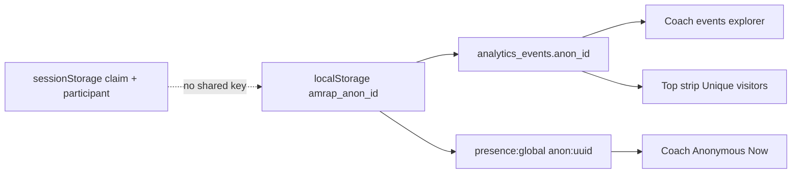

# Anonymous guest tracking — architectural assessment and gap analysis

**Date:** 2026-09-03  
**Trigger:** Coach dashboard **Users by activity → Anonymous Now** shows live guest browsers (`ANON ID`, type **Guest**, green online dot) with no history, no join to an account, and no way to open a dossier. Product is guest-first (create / join / finish a mission without signing in). The question is whether we can tell *who those guests are*, *what they did*, and *whether they came back* — without collapsing guest into “account.”  
**Related:** [analytics-back-end-roadmap](../epics/analytics-back-end-roadmap) (event pipe), [create-account-reentry-2026-09.md](./create-account-reentry-2026-09.md) (what happens after they *do* create an account).

**Vocabulary:** **Guest** = no `auth.uid()`. **Anon id** = long-lived per-browser UUID in `localStorage` (`amrap_anon_id`). **Mission seat** = `participant_id` + claim token in `sessionStorage` for one workout. A **session** is an auth session, not a workout.

---

## 1. What “tracking a guest” means

There is no guest user row. A usable guest identity is three stacked layers that do **not** share a key.

| Layer | Where | Lifetime | Answers |
| ----- | ----- | -------- | ------- |
| Browser anon id | [`identity.ts`](../../src/lib/analytics/identity.ts) `amrap_anon_id` | Until localStorage is cleared | “Same phone / browser as last week?” |
| Product events | `analytics_events.anon_id` via [`track.ts`](../../src/lib/analytics/track.ts) | Forever (append-only) | “What did this browser do?” |
| Live presence | [`presence:global`](../../src/lib/realtime/globalPresenceChannel.ts) key `anon:{uuid}` | This tab, this connection | “Is a guest browser open right now?” |
| Mission seat | [`missionIdentity.ts`](../../src/lib/missionIdentity.ts) claim / participant / nickname | This tab, this mission | “May this device log rounds / lock a score?” |

Coach **Anonymous Now** reads **only the presence layer**. It does not query `analytics_events`, participants, or claim tokens. The filter bar’s Past 24 Hours / 3 Days / Week / Lapsed buckets are `coach_users_list` activity windows for **accounts**. Guests never appear there.

---

## 2. Current architecture

### 2.1 Browser id

[`getOrCreateAnonId()`](../../src/lib/analytics/identity.ts) creates a `crypto.randomUUID()` on first use and keeps it in `localStorage` under `amrap_anon_id`. Comment in code: it is deliberately **not** the per-mission tokens.

If `localStorage` throws, every such client returns the literal string `'unknown'`. Those browsers share one id in both analytics and presence (`anon:unknown`).

There is no identity module test file.

### 2.2 Event pipe

Every `track()` / `trackBeacon()` writes `anon_id` **whether or not** the athlete is signed in. `user_id` is optional context. Inserts go to `analytics_events` with write-only RLS (`INSERT` for `anon` + `authenticated`, no client SELECT) — [`20260826090000_analytics_events.sql`](../../supabase/migrations/20260826090000_analytics_events.sql).

`trackBeacon` hits PostgREST with the public anon key so tab-close events survive. No JWT, so the row is always inserted as the `anon` role; `user_id` is a column, not `auth.uid()`.

Coach surfaces:

| Surface | What it shows about guests |
| ------- | -------------------------- |
| Top strip **Unique visitors (anon)** | `count(DISTINCT anon_id)` **all time**, including signed-in browsers |
| Events explorer | Last 200 events; Anon column is first 8 chars; no filter-by-anon-id |
| Users by activity | Presence-only **Anonymous Now**; other tabs are registered users |

### 2.3 Live presence

[`GlobalPresenceBroadcaster`](../../src/components/GlobalPresenceBroadcaster.tsx) mounts once in [`App.tsx`](../../src/App.tsx). After auth resolves:

- Signed in → presence key = `auth.users.id`
- Guest → `anon:{amrap_anon_id}`

Presence payload is `{ online_at, kind: 'anon' | 'user' }`. It is **ephemeral** — not written to Postgres. [`CoachActivityCohorts`](../../src/components/coach/CoachActivityCohorts.tsx) lists `onlineAnonIds` as truncated ids, type **Guest**, green dot. There is no click handler (unlike registered rows).

The channel is a **public** Realtime Presence topic (`presence:global`). Any client that can subscribe (the whole SPA) can see every key currently tracked. Coach is not a privileged reader; it is just another subscriber.

### 2.4 Mission seat (not guest tracking)

Create / join persist `host_token`, `claim_token`, `participant_id`, nickname in **sessionStorage** scoped by mission id. A guest can finish and lock a score with that seat and never write `amrap_anon_id` onto `participants`. A new tab on the same phone keeps the anon id (localStorage) and **loses** the seat (sessionStorage) unless they rejoin.

### 2.5 What happens on Create account

`auth_signed_in` / `auth_sign_up_succeeded` attach `userId`. The same browser **keeps** `amrap_anon_id` and keeps writing it on later events. Presence **switches** from `anon:{uuid}` to the auth uuid — the guest disappears from Anonymous Now and may appear under Active Now if they are in the top-200 user list.

There is no `anon_id → user_id` stitch table and no backfill of historical events.

---

## 3. What is solid

- Guest product path does not require an account. Anon id is optional enrichment, not an entitlement.
- Analytics inserts cannot be read back through the client (RLS write-only).
- Presence keys are namespaced (`anon:` vs raw uuid) so coach can split the two sets.
- Signed-in broadcast does not keep a second guest presence key, so one tab is not counted twice as “online.”
- Multiple tabs of the same guest share one presence key (same `amrap_anon_id`).
- Coach events explorer already carries `anon_id` for forensic scrolling.
- Mission writes (rounds, score lock) are authorized by claim/uid, not by the marketing anon cookie.

---

## 4. Gaps (most → least critical)

### P0 — The dashboard implies a guest history we do not have

1. **Anonymous Now is a live set, not a cohort.** Past 24 Hours / 3 Days / Week / Lapsed sit on the same bar and only query `coach_users_list`. A coach who just saw two guests online cannot ask “were they here yesterday?” without leaving the product and writing SQL.
2. **Unique visitors (anon) is not “guests.”** It is distinct `amrap_anon_id` values on **every** event, for **all time**, including signed-in browsers and the collapsed `'unknown'` bucket. A growing number does not mean growing anonymous traffic.
3. **No stitch on conversion.** The highest-value guest question — “this browser created an account” — is only inferable if a later event has both `user_id` and the same `anon_id`. There is no first-class link, no coach UI, and presence drops the anon key the moment they sign in.

### P1 — Identity quality and privacy

4. **`'unknown'` collision.** Private mode / blocked storage / some WebViews merge every failing client into one id. Presence then shows one Guest that is actually N browsers; unique-visitor count under-counts them as 1.
5. **Public presence channel.** Any visitor running the SPA (or a crafted client with the anon key) can subscribe to `presence:global` and collect live auth uuids + anon uuids. Coach is not gated at the channel. Fine at three users; a leakage surface at 100 concurrent.
6. **No privacy copy** that a long-lived device id is stored and sent with product events. Guests who never create an account still mint `amrap_anon_id` as soon as anything calls `track` or the presence hook runs (app shell mount).
7. **Open INSERT.** `analytics_events` `WITH CHECK (true)` — anyone with the anon key can flood or spoof `anon_id` / `user_id` / `event_name`. Unique visitors and funnels are not authenticated measurements.

### P2 — Product / coach workflow

8. **Anon id is not clickable.** Coach cannot open events-for-this-id, last route, or last mission. Type is hardcoded `'Guest'`.
9. **Active Now for accounts is presence ∩ top-200 last-active**, not “everyone online” (existing comment in `CoachActivityCohorts`). Guests avoid that bug because Anonymous Now is presence-native — until someone asks for “anonymous last 24h” and copies the account pattern.
10. **Mission seat ≠ anon id.** A guest who finishes The Pacer is a `participant` with a locked score. Coach cannot go from that roster nickname to the anon id that was online, or the reverse.
11. **Astro marketing pages** (`site/`) are a different bundle. Presence and `track` live in the SPA. A guest who only reads `/` or `/amrap-timer` is invisible to Anonymous Now unless they hit an app route.

### P3 — Scale and leftovers

12. **One global Presence topic** for every open app tab. Same class of cost as the old 100-seat poll path: fan-out of join/leave to every subscriber, including guests watching each other.
13. **No retention / rate limit** on `analytics_events` by `anon_id`.
14. Event names still include retired `session_*` leftovers in older rows; new writes use `mission_*`. Guest funnels that mix both will under-count.

---

## 5. Honesty table

| Question | Can we answer it today? |
| -------- | ----------------------- |
| How many guest browsers have the app open right now? | **Yes** — Anonymous Now (presence), if they loaded the SPA |
| Who is guest `1ebecc73…`? | **Id only** — no nickname, route, mission, or account |
| What did that guest do in the last hour? | **Only by hand** — scroll events explorer, match 8-char prefix |
| How many unique **guests** (not signed-in browsers) this week? | **No** — top strip is all-time distinct `anon_id` |
| Did this guest create an account? | **Not as a first-class fact** |
| Did this guest finish a mission? | **Not from anon id** — finish is on `participants` / score lock |
| Past 24h / lapsed **guests**? | **No** — those tabs are registered users |
| Is the measurement tamper-resistant? | **No** — client-chosen `anon_id`, open INSERT, public presence |

---

## 6. Recommended cuts (if we harden this)

Do these in order. None require renaming the data layer.

1. **Define the metric.** Split top-strip into `uniqueAnonIds7d` (events with `user_id IS NULL`) vs all-time / signed-in. Stop labeling the current count “Unique visitors (anon).”
2. **Stitch on sign-in.** On `SIGNED_IN` / successful sign-up, write `(anon_id, user_id, first_seen_at)` once (table or a dedicated event `identity_linked`). Keep writing `anon_id` on later events. Coach can then hide a converted guest from Anonymous Now *and* show “was guest.”
3. **Coach: anon dossier, not a dead row.** Clicking an Anonymous Now id filters `coach_events_recent` (or a small `coach_anon_summary` RPC) by full `anon_id`: last route, last `occurred_at`, event counts, any linked `user_id`.
4. **Historical guest buckets** from `analytics_events` (`max(occurred_at)` per `anon_id` where still unlinked), not from presence. Keep Anonymous Now as the live set.
5. **Stop `'unknown'`.** If storage fails, skip presence broadcast and omit `anon_id` (nullable) rather than collapsing the world into one string.
6. **Private presence or coach-only subscribe.** Guests still *track*; only `is_coach()` clients *listen*. Or drop global presence for guests and derive “anon now” from a 60s heartbeat event if we will not pay for a public channel.
7. **Disclose** the device id on `/privacy` in plain English (browser id for product analytics; not required to train).

Out of scope for this audit: moving guests onto mission Realtime tables, changing claim-token storage, or a full CDP.

---

## 7. Verdict

Guest tracking is **two working pipes that do not meet**. Presence answers “is a guest tab open?” for the screenshot. Analytics answers “did some browser fire events?” for Explore and an all-time counter. Neither is a guest **user**, and the activity filter bar pretends they are.

Treat **Anonymous Now** as an operational pulse, not a CRM. Until stitch + a real guest cohort query exist, do not make product decisions from Unique visitors (anon) or from empty history on a green-dot Guest row.
