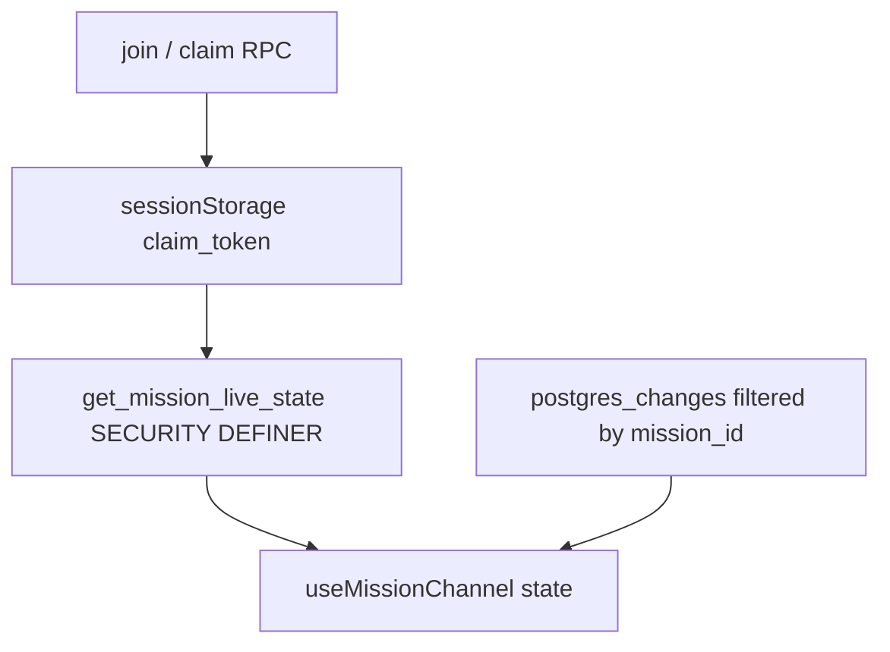

# ADR: Mission read + Realtime scoping

**Status:** Accepted (Phase 0 spike complete)  
**Date:** 2026-08-31  
**Epic:** [`mission-realtime-read-scoping.md`](./mission-realtime-read-scoping.md)  
**Decision makers:** Phase 0 spike (threat model + anon PostgREST proof)

---

## Context

Live missions bootstrap and sync via open PostgREST SELECTs and Realtime `postgres_changes` on `missions`, `participants`, `rounds`, `messages`, and (unfiltered) `participant_segment_results`. Writes already go through SECURITY DEFINER RPCs that prove host token, `auth.uid()`, or claim-token hash. Column grants omit secrets (`host_token`, `claim_token_hash`), but **row** SELECT is `USING (true)` — so a UUID (or enumeration) is enough to read public mission columns.

Guest identity lives only in browser `sessionStorage` ([`missionIdentity.ts`](../../src/lib/missionIdentity.ts): `amrap_claim_token_<missionId>`). PostgREST never receives that token on table SELECT; for anon callers `auth.uid()` is null. Hub precedent: membership RLS on rally-point tables; signed-in Realtime; guests poll `get_rally_point` ([`useRallyPointChannel.ts`](../../src/lib/realtime/useRallyPointChannel.ts)).

Product lock for this epic: **no spectators**. Being on the mission (host path, claimed signed-in participant, or anon with a valid claim for that participant) is required. UUID alone must not be entitlement after cutover.

---

## Threat model — who may read

| Actor | May read this mission? | Mechanism today | Target after epic |
| --- | --- | --- | --- |
| Host | Yes | Open SELECT by UUID; host token for writes | RPC snapshot (host token or host participant) + Realtime |
| Claimed signed-in user | Yes | Open SELECT; writes via `auth.uid()` | RPC and/or RLS on `user_id`; Realtime |
| Anon with claim | Yes (bootstrap **without** using claim) | Open SELECT by UUID only | RPC must verify `p_claim_token`; Realtime TBD (see consequences) |
| Random UUID holder / scraper | **Yes today** | `USING (true)` | **No** |
| Spectator (not joined) | No (product) | Accidental yes via UUID | **No** |

### Evidence (code / schema)

- Claim plaintext in `sessionStorage` only: [`src/lib/missionIdentity.ts`](../../src/lib/missionIdentity.ts).
- Hash-only in DB; SELECT grants omit secrets: initial lobby/session sync + mission rename migrations.
- Bootstrap ignores claim — direct `.from('missions'|…)`: [`useMissionChannel.ts`](../../src/lib/realtime/useMissionChannel.ts) `loadInitial`.
- Write auth pattern (`p_claim_token` hash or `auth.uid()`): e.g. `log_round` / claim RPCs in [`20260901400000_mission_rename.sql`](../../supabase/migrations/20260901400000_mission_rename.sql).
- Permissive SELECT intent documented: [`20260822120000_session_sync_rpcs.sql`](../../supabase/migrations/20260822120000_session_sync_rpcs.sql) (`USING (true)` + hardening comment).
- Hub two-path sync: [`useRallyPointChannel.ts`](../../src/lib/realtime/useRallyPointChannel.ts).

---

## Spike experiment — anon SELECT without claim

**Ran:** 2026-08-31T22:34:21.164Z  
**Env:** hosted project `djtwrbwagytdjlpfcipj.supabase.co` (local `.env` anon key; **not** a production policy change).  
**Method:** Node `fetch` to PostgREST with only `apikey` + `Authorization: Bearer <anon JWT>`. No claim token, no user JWT, no custom headers.

| Check | Result |
| --- | --- |
| `GET /rest/v1/missions?select=id,state,duration_minutes&limit=1` | **200**, 1 row |
| `GET …/missions?id=eq.<that id>&select=id,state,duration_minutes,workout` | **200**, row present; keys `duration_minutes`, `id`, `state`, `workout` |
| `GET …/rounds?mission_id=eq.<id>&select=id&limit=5` | **200** (0 rows for that mission; status still proves SELECT allowed) |
| Claim / user header on request | **Absent** (`requestUsedOnlyAnonJwt: true`) |

Mission id prefix recorded only: `d1551134…` (full UUID omitted from this ADR).

**Conclusion:** Today anon entitlement for mission **reads** is “know the UUID / can hit the table.” Path A (claim-aware RLS for anon) cannot close this hole without putting claim into request context PostgREST/RLS can see — which the current guest model does not do.

---

## Decision

### Architecture: **B — RPC snapshot + narrow Realtime**

Introduce a SECURITY DEFINER live-state RPC (name may vary), e.g.:

`get_mission_live_state(p_mission_id, p_participant_id, p_claim_token)`  
→ mission, participants, rounds, messages, segment_results for that mission.

Authorize like write RPCs: claim-token hash match **or** `auth.uid()` on the participant (host bootstrap may use host participant / host path already returned at join).

Client target: [`useMissionChannel`](../../src/lib/realtime/useMissionChannel.ts) bootstrap calls the RPC instead of open `.from(...)`.

Realtime stays on filtered `postgres_changes` (`mission_id=eq.…` where the column exists). After SELECT revoke, follow hub pattern: authenticated Realtime where RLS allows; guests may need poll of the live-state RPC (or later JWT minting).

### Segment results: **denormalize `mission_id`**

- Add `mission_id uuid NOT NULL` (after backfill) FK → `missions`, indexed.
- BEFORE INSERT/UPDATE trigger: set `mission_id` from `participants.mission_id`.
- Client: `filter: mission_id=eq.${missionId}` on postgres_changes (and on any remaining table query until RPC owns bootstrap).

Do **not** rely on `participant_id=in.(…)` as the primary approach (roster churn + filter length at cap 100).

---

## Rejected alternatives

| Option | Why rejected |
| --- | --- |
| **A. Claim-aware RLS for anon** | Claim lives only in `sessionStorage`. Table SELECT never sends it; `auth.uid()` is null for guests. RLS cannot verify anon entitlement without a GUC, custom JWT claim, or similar request context we do not have today. Spike SELECT proof confirms the current hole is UUID-only. |
| **C. Mission-scoped views** | Does not by itself prove anon claim; Supabase Realtime on views is fragile. Skip unless B is blocked in Phase 1–2. |

---

## Consequences

1. **Two-path bootstrap** (like the hub): RPC for entitlement-checked snapshot; Realtime for deltas where the role can SELECT.
2. **Realtime is still not claim-proof for anon** until SELECT is revoked *and* a guest path exists. After revoke, anon Realtime may go silent (same class of issue as hub guests).
3. **Phase 2 mitigation direction (choose in implementation, preference order):**  
   (a) authenticated Realtime via `participants.user_id = auth.uid()` for signed-in athletes;  
   (b) **guest poll** of `get_mission_live_state` on an interval (hub-style);  
   (c) later JWT minting for guests — **out of epic** unless (a)+(b) fail product needs.
4. **Denorm cost:** one column + trigger + backfill migration; cleaner than `in.(…)` filters.
5. **Phase 0 ships no production cutover** — no RLS revoke, no live RPC deploy required by this ADR alone.

---

## Phase handoff checklist

Pointing back to [`mission-realtime-read-scoping.md`](./mission-realtime-read-scoping.md):

### Phase 1 — Segment-results Realtime scoping

- [x] Migration: `mission_id` on `participant_segment_results`, backfill, trigger, index, Realtime replica identity as needed.
- [x] Client: subscribe with `mission_id=eq.${missionId}`; remove unfiltered listener.
- [x] Tests cover filter wiring; no production SELECT revoke required in this phase.

### Phase 2 — SELECT / RLS + RPC bootstrap

- [ ] Implement `get_mission_live_state` (or final name); authorize like `log_round`.
- [ ] Cut `useMissionChannel` bootstrap to RPC.
- [ ] Replace `USING (true)` / revoke open SELECT as designed.
- [ ] Ship guest Realtime mitigation: prefer (a)+(b) above; document choice in epic.
- [ ] Acceptance: anon **without** join/claim cannot SELECT another mission’s rows; joined guest still loads waiting room.

### Explicitly out of Phase 0

Implementing the RPC, denorm migration, RLS changes, or client cutover.

---

## Acceptance (Phase 0)

- [x] ADR under `docs/epics/` with threat model (no spectators) and locked **B** + denorm `mission_id`.
- [x] Documented proof that anon SELECT works without claim today (and why A fails).
- [x] Explicit Realtime-after-revoke risk + mitigation direction for Phase 2.
- [x] Epic Phase 0 links this ADR; **no** production RLS revoke or live RPC cutover in this phase.
