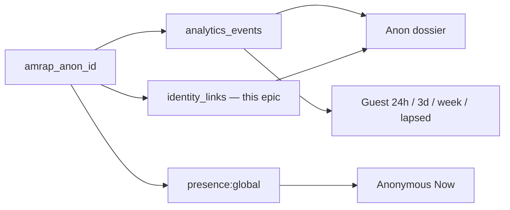

# Epic: Anonymous guest tracking

**Branch:** TBD — suggest `feature/anonymous-guest-tracking`  
**Status:** Draft  
**Last updated:** 2026-09-03  
**Source audit:** [anonymous-guest-tracking-2026-09.md](../audits/anonymous-guest-tracking-2026-09.md)  
**Related:** [analytics-back-end-roadmap](./analytics-back-end-roadmap), [create-account-reentry-2026-09.md](../audits/create-account-reentry-2026-09.md)

---

## Vision

The product is guest-first. A coach must be able to answer three questions without turning a guest into an account:

1. How many **guest browsers** are in the app **right now**?
2. What did **this** browser do, and did it come back?
3. Did that browser **create an account**?

Today those answers live in two pipes that do not meet: ephemeral `presence:global` (`anon:{amrap_anon_id}`) and append-only `analytics_events.anon_id`. The **Users by activity** bar pretends guests have the same history as accounts. They do not.

> Anonymous Now is an operational pulse, not a CRM. This epic makes the pulse honest, then adds stitch + history so a green-dot Guest row is a dossier, not a dead id.

**Vocabulary:** **Guest** = no `auth.uid()`. **Anon id** = `localStorage` `amrap_anon_id`. **Mission seat** = claim token + `participant_id` (not this epic’s identity). A **session** is an auth session.

---

## Current state (baseline)

| Area | Today | Gap |
| ---- | ----- | --- |
| Browser id | [`getOrCreateAnonId()`](../../src/lib/analytics/identity.ts) UUID in `localStorage` | `'unknown'` if storage fails |
| Events | [`track.ts`](../../src/lib/analytics/track.ts) always writes `anon_id` | Open INSERT; signed-in browsers counted as “anon visitors” |
| Presence | [`presence:global`](../../src/lib/realtime/globalPresenceChannel.ts); guests `anon:{uuid}` | Public channel; coach is just another subscriber |
| Anonymous Now | [`CoachActivityCohorts`](../../src/components/coach/CoachActivityCohorts.tsx) lists live `onlineAnonIds` | No click, no history, type hardcoded Guest |
| Other activity tabs | `coach_users_list` time buckets | **Accounts only** — guests never appear |
| Top strip | `count(DISTINCT anon_id)` all time | Not “guests this week” |
| Conversion | Presence drops `anon:` on sign-in; events keep writing both ids | No `anon_id → user_id` row |
| Privacy | — | No `/privacy` copy for the device id |



---

## Goals

1. **Honest metrics** — top strip and activity tabs do not call signed-in browsers “anonymous visitors.”
2. **Stitch** — first sign-in on a browser records `(anon_id, user_id)` once.
3. **Dossier** — coach can open a live Guest id and see last route, last seen, event counts, linked account.
4. **Guest history** — Past 24h / 3d / week / lapsed for **unlinked** anon ids, from events, not presence.
5. **Safer identity** — no `'unknown'` bucket; guests do not need to *listen* on a public presence topic.
6. **Disclose** the device id in plain English.

## Non-goals

- Moving guests onto mission Realtime tables (live-state scale epic).
- Changing claim-token / `sessionStorage` mission seats.
- A CDP, email capture for guests, or marketing-site (`site/`) presence.
- Tamper-proof analytics (rate-limit INSERT is a later ops slice, not required to ship 1–4).
- Linking roster nickname ↔ anon id on `participants` (seat ≠ browser id).

---

## Phases

Each phase is **one planning slice**. Paste the **Planning prompt** into a new Plan-mode chat after this epic is the source of truth. Plan, implement, and ship independently where dependencies allow.

---

### Phase 1 — Honest guest metrics

**Planning goal:** Stop labeling all-time distinct `anon_id` as unique anonymous visitors. Coach top strip reports guests vs everyone, with a 7-day window.

#### Scope

- Change [`coach_dashboard`](../../supabase/migrations/20260826150000_coach_dashboard.sql) top strip: replace or accompany `uniqueAnonIds` with:
  - `guestBrowsers7d` — `count(DISTINCT anon_id)` where `user_id IS NULL` and `occurred_at >= now() - 7 days` and `anon_id` is a real UUID (not `'unknown'`).
  - Keep an all-time or signed-in-browser number only if the label is explicit.
- Coach UI: [`CoachPage.tsx`](../../src/pages/CoachPage.tsx) label **Guest browsers (7d)** — not “Unique visitors (anon).”
- Types + tests in [`coach.ts`](../../src/lib/api/coach.ts) / `coach.test.ts`.

#### Dependencies

- None.

#### Deliverables

- [ ] Migration replacing `coach_dashboard` top-strip keys (or additive keys + UI cutover).
- [ ] Client types and copy.
- [ ] Test: parser accepts new keys; old `uniqueAnonIds` not shown as “anon visitors.”

#### Planning questions

- Additive keys vs rename? Prefer additive (`guestBrowsers7d`) so an old client does not blank the strip.
- Exclude `anon_id = 'unknown'` in SQL now, even if Phase 3 has not shipped the client fix?

#### Out of scope

- Stitch table, dossier, historical guest tabs, presence privacy.

#### Planning prompt

```
Plan Phase 1 of docs/epics/anonymous-guest-tracking.md (Honest guest metrics).

Source audit: docs/audits/anonymous-guest-tracking-2026-09.md §4 P0 item 2 and §6 cut 1.

Goal: coach top strip reports distinct guest browsers in the last 7 days (events with user_id IS NULL), not all-time distinct anon_id including signed-in browsers.

Constraints: SECURITY DEFINER RPC only (coach_dashboard). Additive JSON keys if needed. Design tokens / existing CoachPage strip layout. No presence or stitch work. npm test coverage on the client parser.
```

---

### Phase 2 — Identity stitch on sign-in

**Planning goal:** Record one durable `(anon_id, user_id)` link when a browser creates an account or signs in, without changing claim tokens.

#### Scope

- New table (suggested `analytics_identity_links`): `anon_id text`, `user_id uuid` → `auth.users`, `first_seen_at`, unique on `(anon_id, user_id)`. RLS: no client SELECT; write only via SECURITY DEFINER RPC.
- RPC e.g. `link_anon_identity(p_anon_id text)` — `auth.uid()` required; ignore `'unknown'` / empty; insert-once (`ON CONFLICT DO NOTHING`).
- Client: call from [`AmrapAuthProvider`](../../src/contexts/AmrapAuthProvider.tsx) on `SIGNED_IN` and after successful password/Google sign-up (same places that already `track('auth_signed_in'…)`).
- Keep writing `anon_id` on later `track()` rows (do not stop after link).

#### Dependencies

- None (can ship before or after Phase 1). Phase 4–5 consume the table.

#### Deliverables

- [ ] Migration + grants (authenticated execute; revoke from `anon`).
- [ ] Client call; never block auth UX on link failure.
- [ ] Tests: RPC contract (vitest against SQL text if no Deno); client calls link once per sign-in attempt path.

#### Planning questions

- One row per pair forever, or also `last_seen_at` on repeat sign-in?
- Should `SIGNED_IN` from token refresh fire the RPC (idempotent) or only `PASSWORD` / `GOOGLE` / first session?

#### Out of scope

- Backfilling historical events. Coach UI. Changing presence keys.

#### Planning prompt

```
Plan Phase 2 of docs/epics/anonymous-guest-tracking.md (Identity stitch on sign-in).

Source audit: docs/audits/anonymous-guest-tracking-2026-09.md §2.5 and §6 cut 2.

Goal: first-class (anon_id, user_id) link written once via SECURITY DEFINER RPC when the athlete signs in or creates an account on a browser that already has amrap_anon_id.

Constraints: All DB access through RPCs. Do not block sign-in on analytics failure. Do not change mission claim tokens. Unique (anon_id, user_id). Ignore unknown/empty anon ids. Keep track() writing anon_id after link.
```

---

### Phase 3 — Stop the `'unknown'` collision

**Planning goal:** Failed `localStorage` must not mint a shared `'unknown'` identity for analytics or presence.

#### Scope

- [`identity.ts`](../../src/lib/analytics/identity.ts): return `null` when storage fails or no id can be created. Add `identity.test.ts` (jsdom).
- [`track.ts`](../../src/lib/analytics/track.ts): omit `anon_id` (SQL already nullable) when null.
- [`useGlobalPresenceBroadcast`](../../src/hooks/useGlobalPresenceBroadcast.ts): if guest and no anon id, **do not** `startGlobalPresenceBroadcast` (no `anon:unknown`).
- Phase 2 RPC already ignores empty/`unknown`; leave a one-line guard.

#### Dependencies

- None. Ship before or with Phase 1 SQL exclude.

#### Deliverables

- [ ] Null-safe identity + tests.
- [ ] Presence skip + existing presence tests still pass.
- [ ] Track payload omits or nulls `anon_id`.

#### Planning questions

- In-memory UUID for the tab lifetime (presence only, not persisted) vs no presence at all? **Lock: no presence** if we cannot persist — avoids a new ghost id every refresh.

#### Out of scope

- Privacy page copy (Phase 7). Presence channel privacy (Phase 6).

#### Planning prompt

```
Plan Phase 3 of docs/epics/anonymous-guest-tracking.md (Stop the unknown collision).

Source audit: docs/audits/anonymous-guest-tracking-2026-09.md §2.1 and §6 cut 5.

Goal: getOrCreateAnonId no longer returns the literal "unknown". Failed storage → null. track() omits anon_id. Guest presence does not broadcast. Locked: no ephemeral in-memory UUID for presence.

Constraints: Smallest change to identity.ts / track.ts / useGlobalPresenceBroadcast. Unit tests beside identity.ts. Do not change missionIdentity sessionStorage.
```

---

### Phase 4 — Coach anon dossier

**Planning goal:** A live Guest row is a dossier: last route, last seen, event counts, linked account if Phase 2 has fired.

#### Scope

- New `is_coach()` RPC e.g. `coach_anon_summary(p_anon_id text)` → `{ lastOccurredAt, lastRoute, eventCount, eventNameCounts, linkedUserId, linkedNickname }` from `analytics_events` + `analytics_identity_links` (if present). Cap event aggregation (e.g. last 90 days).
- [`CoachActivityCohorts`](../../src/components/coach/CoachActivityCohorts.tsx): Anonymous Now rows are buttons; selecting one loads the summary (panel or reuse the existing user-detail slot).
- Events explorer: optional `p_anon_id` on `coach_events_recent` so the dossier can show the same table filtered.

#### Dependencies

- Phase 2 for “linked account.” Can ship dossier **without** links (linked fields null) and light up after Phase 2.

#### Deliverables

- [ ] RPC + client types + tests.
- [ ] Clickable Guest rows; empty state when the id has no events (presence-only tab).
- [ ] Do not show full UUID in the table; keep truncate + `title` for copy.

#### Planning questions

- Reuse the registered-user detail column vs a compact card under the table?
- **Lock: compact card under the Anonymous Now table** — registered user detail is account-shaped (email, missions, HUD). Do not force-fit.

#### Out of scope

- Historical cohort tabs (Phase 5). Changing presence.

#### Planning prompt

```
Plan Phase 4 of docs/epics/anonymous-guest-tracking.md (Coach anon dossier).

Source audit: docs/audits/anonymous-guest-tracking-2026-09.md §6 cut 3.

Goal: coach clicks an Anonymous Now guest id and sees last route, last seen, event counts, and linked user if analytics_identity_links exists.

Constraints: SECURITY DEFINER + is_coach(). Compact card under the Anonymous Now table — do not reuse the registered-user profile pane. Truncated id in the table. Presence-only ids (no events) get an honest empty state. Additive p_anon_id on coach_events_recent is in scope if small.
```

---

### Phase 5 — Historical guest cohorts

**Planning goal:** Past 24 Hours / 3 Days / Week / Lapsed mean the same thing for **unlinked guest browsers** that they mean for accounts — from `analytics_events`, not presence.

#### Scope

- RPC e.g. `coach_guest_list(p_activity_bucket, p_limit)` — distinct `anon_id` where not linked (or linked shown as converted), `max(occurred_at)` in bucket. Exclude `'unknown'`. Cap 200.
- Activity bar: either a second table when those tabs are selected **and** a “Guests” toggle, or dedicated guest buckets. **Lock: same tabs, two tables** (Accounts | Guests) so the current account queries do not change meaning.
- Anonymous Now stays presence-only (live). Do not filter historical RPC by presence.

#### Dependencies

- Phase 2 to exclude converted browsers from “still a guest.” Phase 1 labels so coaches are not confused. Phase 3 so `'unknown'` is gone from new data.

#### Deliverables

- [ ] RPC + buckets matching `activityCohorts.ts` (`last_24h`, `last_3d`, `last_7d`, `lapsed`).
- [ ] UI: Accounts table unchanged; Guests table under it for those four tabs.
- [ ] Click guest row → Phase 4 dossier.

#### Planning questions

- Is “lapsed” 7+ days since last **event**, same as accounts’ last-active? **Lock: yes** — `max(occurred_at)`.
- Include linked-but-was-guest in a badge, or hide them from the guest table? **Lock: hide** from guest table once linked.

#### Out of scope

- Marketing-site visitors. Mission-seat join. Presence changes.

#### Planning prompt

```
Plan Phase 5 of docs/epics/anonymous-guest-tracking.md (Historical guest cohorts).

Source audit: docs/audits/anonymous-guest-tracking-2026-09.md §4 P0 item 1 and §6 cut 4.

Goal: Past 24 Hours / 3 Days / Week / Lapsed show a Guests table of unlinked anon ids from analytics_events (max occurred_at), while Accounts stay on coach_users_list. Anonymous Now remains presence-only.

Constraints: Same tab ids in activityCohorts.ts. Two tables, not a mixed list. Hide linked anon ids from the guest table. Cap 200. Click opens the Phase 4 dossier. Do not derive history from presence.
```

---

### Phase 6 — Presence: guests track, only coach listens

**Planning goal:** A random visitor must not receive every live auth uuid and anon uuid on `presence:global`.

#### Scope

- Split listen vs track:
  - All clients may **track** (current `startGlobalPresenceBroadcast`).
  - Only `is_coach()` sessions **subscribe** to sync/join/leave and populate `subscribeOnlineUserIds` / `subscribeOnlineAnonIds`.
- Implementation options to evaluate in the plan (pick one, do not leave A/B in the implementation):
  - **Locked default:** two channel configs or a private channel name coaches join after `is_coach()`; guests track on a channel they do not sync (if Supabase Presence requires subscribe-to-track, use a **write-only** pattern: guests track, coach is the only component that calls `subscribeOnline*`).
- If Presence cannot track without also receiving the roster, fall back to: guests stop using `presence:global`; coach “Anonymous Now” becomes “anon ids with an event in the last 90s” via a tiny heartbeat `track('presence_heartbeat')` + RPC. Prefer keeping Presence if a coach-only listener works.

#### Dependencies

- Phase 3 (no `'unknown'` keys). Anonymous Now UI unchanged.

#### Deliverables

- [ ] Guests no longer observe other keys (test or documented Realtime constraint + implementation).
- [ ] Coach Anonymous Now still updates live.
- [ ] Non-coach pages never mount `useOnlineAnonIds` / `useOnlineUserIds` except Coach.

#### Planning questions

- Confirm whether `channel.track()` without presence event handlers still receives `presenceState`. If yes, guests must not subscribe to `presence:global` at all — use heartbeat fallback.
- Auth users’ uuids on a public channel are the leak; treat that as in-scope even if we only came for guests.

#### Out of scope

- 100-seat mission poll path. Heartbeat if Presence coach-only listen works.

#### Planning prompt

```
Plan Phase 6 of docs/epics/anonymous-guest-tracking.md (Presence: guests track, only coach listens).

Source audit: docs/audits/anonymous-guest-tracking-2026-09.md §2.3, §4 items 5 and 12, §6 cut 6.

Goal: a non-coach SPA client must not receive the global presence roster (auth uuids + anon uuids). Coach Anonymous Now stays live.

Locked default: coach-only listeners (useOnline* only on Coach). If track() without subscribe still delivers the roster, plan the heartbeat fallback (presence_heartbeat + RPC “seen in last 90s”) instead of a half-private channel.

Constraints: Do not change mission channels. Do not require guests to sign in. Document the Supabase Presence constraint you verified.
```

---

### Phase 7 — Privacy disclosure

**Planning goal:** A first-time visitor can read, in plain English, that a browser id is stored for product analytics and is not required to train.

#### Scope

- Astro `/privacy` page (content owned by `site/`, tokens from `src/index.css`). One short section: what `amrap_anon_id` is, that events are write-only, that signing in can associate the id with the account (Phase 2), how to clear it (clear site data).
- No new consent banner. No cookie-law theatre unless legal later requires it.

#### Dependencies

- Phase 2 wording (“may be linked when you create an account”) if stitch has shipped; otherwise say “not linked to an account until you sign in” and update in a one-line follow-up.

#### Deliverables

- [ ] Privacy section live on the static site.
- [ ] No SPA route change.

#### Planning questions

- None that block — copy only.

#### Out of scope

- GDPR consent, cookie manager, opt-out RPC.

#### Planning prompt

```
Plan Phase 7 of docs/epics/anonymous-guest-tracking.md (Privacy disclosure).

Source audit: docs/audits/anonymous-guest-tracking-2026-09.md §6 cut 7.

Goal: add a plain-English section on the Astro /privacy page describing the browser id (amrap_anon_id), write-only analytics, optional link on sign-in, and that clearing site data drops it. Training does not require the id.

Constraints: site/ content page; shared design tokens; no consent banner; no new SPA route. Match existing privacy tone. CLAUDE.md: Mission is the workout word — do not say session for workouts.
```

---

## Phase dependency graph

```
Phase 1 metrics ──────────────┐
Phase 3 no-unknown ───────────┼─→ Phase 5 guest cohorts
Phase 2 stitch ──→ Phase 4 dossier ─┘
Phase 3 ──→ Phase 6 presence privacy
Phase 2 (copy) ──→ Phase 7 privacy page
```

Phases **1, 2, 3** can start in parallel. **4** can start after 2 (or with null links). **5** after 1+2+3. **6** after 3. **7** anytime; refresh copy after 2.

---

## Acceptance (epic done)

- [ ] Top strip **Guest browsers (7d)** is unlinked `anon_id`s in seven days — not all-time every browser.
- [ ] Sign-in writes `analytics_identity_links` once; later events still carry `anon_id`.
- [ ] No `'unknown'` anon id in new writes or presence keys.
- [ ] Coach can open a Guest id and see last route / last seen / counts / linked account.
- [ ] Past 24h / 3d / week / lapsed show a **Guests** table from events; Anonymous Now stays live presence (or heartbeat if Phase 6 fell back).
- [ ] Non-coach clients do not receive the global presence roster.
- [ ] `/privacy` discloses the device id.
- [ ] `npm run lint && npm run typecheck && npm run test` green; `supabase db push` for each migration before production relies on it.

---

## Risks

| Risk | Mitigation |
| ---- | ---------- |
| Coaches used Unique visitors (anon) as a vanity number | Additive key + new label; do not silently shrink the old digit |
| Presence cannot track without roster | Phase 6 heartbeat fallback, planned before coding |
| Stitch RPC called on every token refresh | Idempotent unique pair; optional last_seen update |
| Guest list scans `analytics_events` | Index `(anon_id, occurred_at desc)` in Phase 5 migration; 90-day window if needed |
| Mission seat still invisible | Accepted non-goal; do not fake a join in the dossier |
