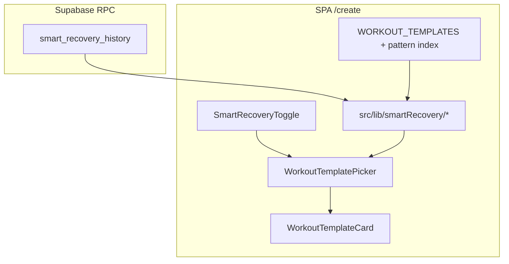

# Epic: Smart Recovery (Fatigue Management)

**Branch:** TBD — suggest `feature/smart-recovery`  
**Status:** Draft — awaiting review  
**Last updated:** 2026-09-01

---

## Vision

When an athlete opens the workout library to create a mission, the picker today shows every template as equally available. Smart Recovery adds an **optional advisory layer**: cross-reference recent **locked** (scored) mission history and temporarily **soft-lock** templates that would violate recovery windows — same workout too soon, CNS overload from back-to-back Tier 4/5 work, or hammering the same movement pattern twice in 48 hours.

This is **not** a server-side ban. Turning the toggle **off** immediately restores full library access. Locked cards stay **visible** but matte, with a lock icon and time remaining. The athlete can always bypass by disabling Smart Recovery.

Smart Recovery complements — does not replace — the existing **overtraining load** advisory on the HUD (`compute_overtraining_load` → ACWR / consecutive hard-day warnings). Overtraining speaks in aggregate load; Smart Recovery speaks in **which specific workouts** to avoid today.

---

## Current state (baseline)

| Area | Today | Gap for Smart Recovery |
| --- | --- | --- |
| Workout library | 150 static templates in [`src/data/workoutTemplates.ts`](../../src/data/workoutTemplates.ts); picker on [`/create`](../../src/pages/CreateMissionPage.tsx) via [`WorkoutTemplatePicker`](../../src/components/createMission/WorkoutTemplatePicker.tsx) | No recovery gating on cards |
| Template metadata | `intensityTier` (1–5), `category`, `movements[]` (name/reps/unit only) | **No movement-pattern or muscle-group tags** |
| Exercise library | [`src/data/exerciseLibrary.ts`](../../src/data/exerciseLibrary.ts) — coaching copy, photos; **no pattern fields** | Must tag exercises or templates |
| Completion history | Locked when `participant_segment_results.score_breakdown IS NOT NULL`; clock = `psr.updated_at` | [`my_missions()`](../../supabase/migrations/20260901400000_mission_rename.sql) returns `template_id` but **not** `intensity_tier` or lock timestamp |
| Load advisory | [`compute_overtraining_load()`](../../supabase/migrations/20260901400000_mission_rename.sql) — 7d/28d load, consecutive tier ≥4 days | Template-level lockout **does not exist** |
| Coach workouts | Supabase `coach_workouts` with `intensity_tier`, freeform `tags[]` | Unstructured tags; picker is [`CoachWodPicker`](../../src/components/createMission/CoachWodPicker.tsx) — **out of v1 scope** unless Phase 5 |
| Guests | Scores persist but `participants.user_id IS NULL` until claim | Smart Recovery **requires auth** — no history until claimed |
| Astro library | Static `/amrap-workouts/*` — SEO only, no interactive picker | Toggle lives on **SPA create flow** in v1 |

There are **zero** references to “Smart Recovery” in the codebase today.

---

## Functional requirements (product)

### Deactivation ruleset

All windows start at **`participant_segment_results.updated_at`** (score lock time), not mission create time.

| Rule | Trigger | Lock duration | Scope |
| --- | --- | --- | --- |
| **Exact match** | User completed template `T` | **6 days** (constant; tunable 5–7 in config) | Same `template_id` only |
| **Severe intensity** | User completed any mission with `intensity_tier >= 4` | **72 hours** | All library templates with `intensityTier >= 4` |
| **Movement pattern** | User completed a workout whose **primary patterns** include pattern `P` | **48 hours** | All templates whose primary patterns **overlap** `P` |

**Precedence when multiple rules apply:** show the **longest remaining** lock on a card; reason copy reflects the strictest active rule (exact match > severe intensity > pattern).

**Eligible completions:** `participants.user_id = auth.uid()` AND `score_breakdown IS NOT NULL` (same gate as HUD / ghosts).

### UI / UX

| Element | Behavior |
| --- | --- |
| **Toggle** | “Enable Smart Recovery” switch above the template grid in `WorkoutTemplatePicker` (signed-in only) |
| **Default** | Off (opt-in) — stored in `localStorage` key `smartRecoveryEnabled` for v1 |
| **Locked card** | Visible; reduced opacity (`opacity-50` or token equivalent); **not selectable**; lock icon + “Recovery lock: {remaining}” |
| **Bypass** | Toggle off → all locks cleared instantly; no refetch required |
| **Unsigned** | Hide toggle or show disabled copy: “Sign in to enable Smart Recovery” |

Use design tokens (`var(--color-*)`) for muted/locked chrome — no hard-coded charcoal hex.

---

## Architecture



**Principle (matches HUD epic):** history aggregation stays on the server; lock **rules** stay in tested pure functions on the client (templates are client-side data). Do not ship full `my_missions()` payloads just to compute locks.

---

## Phase 0 — Taxonomy & spike (no UI)

**Goal:** Agree on movement-pattern vocabulary and mapping strategy before tagging 75+ exercises.

**Status:** Complete — 2026-09-01

### Deliverables

1. **Pattern enum** in [`src/lib/smartRecovery/movementPatterns.ts`](../../src/lib/smartRecovery/movementPatterns.ts):

   ```ts
   export type MovementPattern =
     | 'upper-push'
     | 'upper-pull'
     | 'lower-body'
     | 'core'
     | 'full-body-conditioning';
   ```

   Map product language (“Upper Body Push”, “Core”) to these ids for UI copy via `MOVEMENT_PATTERN_LABELS`.

2. **Category default map** (fallback when exercise tags are missing):

   | `WorkoutCategory` | Default `MovementPattern[]` | Rationale |
   | --- | --- | --- |
   | `blood-shunt` | `['full-body-conditioning']` | PHA couplets — systemic, not single-pattern |
   | `localized-trap` | `[]` (empty) | No safe default — exercise tags required |
   | `engine-room` | `['full-body-conditioning']` | Cardio-dominant, low local bottleneck |
   | `midline-tension` | `['core']` | Category prose is midline-specific |
   | `aerobic-matrix` | `['full-body-conditioning']` | 20-min grind |
   | `four-point-cascade` | `['full-body-conditioning']` | 4-movement rotation |
   | `armor-protocol` | `['full-body-conditioning']` | Mixed modal |

3. **Draft exercise map** in [`src/lib/smartRecovery/draftExercisePatterns.ts`](../../src/lib/smartRecovery/draftExercisePatterns.ts) — all 73 `EXERCISE_LIBRARY` ids tagged for Phase 1 merge into `ExerciseInfo.primaryPatterns`.

4. **Spike script** [`scripts/smart-recovery-pattern-spike.ts`](../../scripts/smart-recovery-pattern-spike.ts) — run: `npx tsx scripts/smart-recovery-pattern-spike.ts`.

### Tagging rubric

| Pattern | Assign when movement is primarily… |
| --- | --- |
| `upper-push` | Horizontal/vertical push: push-ups, dips, pike, handstand work |
| `upper-pull` | Pulling / posterior chain upper: rows, pull-ups, hinges loading back |
| `lower-body` | Squat/lunge/jump patterns loading quads/glutes |
| `core` | Anti-extension, rotation, hollow, leg raise, plank variants |
| `full-body-conditioning` | Burpees, jacks, shuffles, broad jumps, multi-segment cardio |

**Rules:**

- Multi-pattern allowed (e.g. thrusters → `['lower-body', 'upper-push']`)
- Prefer **primary mover under fatigue**, not every muscle touched
- When unsure, check category usage in templates via spike output

### Spike results (2026-09-01)

| Metric | Category-only | Exercise-enriched |
| --- | --- | --- |
| Templates with ≥1 pattern | 120 / 150 (80.0%) | **150 / 150 (100.0%)** |
| Templates with empty patterns | 30 (all `localized-trap`) | 0 |
| Top-pattern mismatches vs enriched | — | 76 / 150 |

**Per-category top-pattern mismatches** (category-only vs exercise-enriched):

| Category | Templates | Mismatches | Enriched empty |
| --- | --- | --- | --- |
| `localized-trap` | 30 | 30 | 0 |
| `blood-shunt` | 30 | 15 | 0 |
| `midline-tension` | 30 | 9 | 0 |
| `armor-protocol` | 10 | 8 | 0 |
| `four-point-cascade` | 10 | 7 | 0 |
| `aerobic-matrix` | 10 | 6 | 0 |
| `engine-room` | 30 | 1 | 0 |

**Conclusion:** Category-only fails on all 30 `localized-trap` templates (empty default) and misclassifies most `blood-shunt` couplets as generic conditioning. Exercise-enriched tagging is **required** for v1 — no manual per-template exceptions needed at this stage.

Sample mismatches: *The Piston* (blood-shunt) → category `full-body-conditioning` vs enriched `lower-body, upper-push`; *Shock & Awe* → category `full-body-conditioning` vs enriched `core, full-body-conditioning`.

### Exit criteria

- [x] Pattern list approved (five patterns sufficient for v1 — no grip/shoulder split)
- [x] ≥90% of library templates resolve at least one primary pattern without manual per-template exceptions (100% exercise-enriched)

---

## Phase 1 — Data model updates (client metadata)

**Goal:** Structured tags so lock rules can run without NLP on movement names.

**Status:** Complete — 2026-09-01. Canonical exercise tags live in [`exercisePatternTags.ts`](../../src/lib/smartRecovery/exercisePatternTags.ts); merged onto `ExerciseInfo.primaryPatterns` via `libEntry()` in the exercise library.

### 1.1 Exercise library

Extend [`ExerciseInfo`](../../src/data/exerciseLibrary.ts):

```ts
export interface ExerciseInfo {
  // existing fields…
  /** Primary movement patterns this exercise loads. At least one required. */
  primaryPatterns: MovementPattern[];
}
```

- Tag all entries in `EXERCISE_LIBRARY`.
- Unit test: every exercise has ≥1 pattern; no unknown pattern ids.

### 1.2 Template pattern derivation

New pure module [`src/lib/smartRecovery/deriveTemplatePatterns.ts`](../../src/lib/smartRecovery/deriveTemplatePatterns.ts):

```ts
export function deriveTemplatePrimaryPatterns(template: WorkoutTemplate): MovementPattern[];
```

**Algorithm (v1):**

1. For each movement, resolve `getExerciseInfo(name)` → union `primaryPatterns`.
2. If exercise unknown, fall back to **category default** map:

   | `WorkoutCategory` | Default patterns |
   | --- | --- |
   | `blood-shunt` | `full-body-conditioning` |
   | `localized-trap` | `[]` (empty — exercise tags required) |
   | `engine-room` | `full-body-conditioning` |
   | `midline-tension` | `core` |
   | `aerobic-matrix` | `full-body-conditioning` |
   | `four-point-cascade` | `full-body-conditioning` |
   | `armor-protocol` | `full-body-conditioning` |

3. Return **top 2 patterns by frequency** across movements as `primaryPatterns` (stored in memory / computed at runtime — **no new column on `WorkoutTemplate`** for v1).

Optional v1.1: add `primaryPatterns?: MovementPattern[]` on `WorkoutTemplate` for the ~10% edge cases where derivation is wrong — frozen in CI like benchmark fingerprints.

### 1.3 Coach workouts (deferred)

Phase 5 — derive from `coach_workouts.movements` + coach exercise links, or require coach to pick patterns at publish time.

### Exit criteria

- [x] `deriveTemplatePatterns.test.ts` covers each category + unknown exercise fallback
- [x] No changes to Supabase schema in Phase 1

---

## Phase 2 — Backend: recovery history RPC

**Goal:** Slim, auth-scoped completion slice for lock calculation.

**Status:** Complete — 2026-09-01. Migration [`20260902200000_smart_recovery_history.sql`](../../supabase/migrations/20260902200000_smart_recovery_history.sql); client wrapper [`smartRecovery.ts`](../../src/lib/api/smartRecovery.ts).

### 2.1 New RPC: `smart_recovery_history()`

**Migration:** new file e.g. `supabase/migrations/YYYYMMDD_smart_recovery_history.sql`

```sql
-- Returns locked missions in the lookback window needed by all rules (max 7 days).
CREATE OR REPLACE FUNCTION public.smart_recovery_history()
RETURNS jsonb
-- SECURITY DEFINER, auth.uid() required
```

**Payload:**

```ts
export type SmartRecoveryHistoryEntry = {
  templateId: string | null;
  intensityTier: number; // coalesce(missions.intensity_tier, 2)
  completedAt: string;   // ISO timestamptz, psr.updated_at
};

export type SmartRecoveryHistoryPayload = {
  ok: true;
  completions: SmartRecoveryHistoryEntry[];
};
```

**Query:** Same joins as `compute_overtraining_load` (participants → missions → psr), filter `score_breakdown IS NOT NULL`, `psr.updated_at >= now() - interval '7 days'`, order DESC.

**Why not extend `my_missions()`?** That RPC returns full workout JSON and unbounded history — wrong shape and too heavy. Keep Smart Recovery read path narrow.

**Client wrapper:** [`src/lib/api/smartRecovery.ts`](../../src/lib/api/smartRecovery.ts) mirroring [`hudTelemetry.ts`](../../src/lib/api/hudTelemetry.ts).

### 2.2 Optional: extend `my_missions()` later

Add `intensity_tier` and `completed_at` to `MyMissionEntry` for My Missions UI — **not required** for Smart Recovery if the dedicated RPC ships.

### Exit criteria

- [x] RPC + RLS: anon revoked, authenticated granted
- [x] SQL test or migration comment with example row shape
- [x] Client types + fetch wrapper

---

## Phase 3 — Pure lock engine (client)

**Goal:** Testable ruleset with no React dependencies.

**Status:** Complete — 2026-09-01. Lock engine in [`computeRecoveryLocks.ts`](../../src/lib/smartRecovery/computeRecoveryLocks.ts); constants in [`recoveryRules.ts`](../../src/lib/smartRecovery/recoveryRules.ts); remaining copy in [`formatRecoveryRemaining.ts`](../../src/lib/smartRecovery/formatRecoveryRemaining.ts).

### Module layout

```
src/lib/smartRecovery/
  movementPatterns.ts      # enum + display labels
  deriveTemplatePatterns.ts
  recoveryRules.ts         # duration constants
  computeRecoveryLocks.ts  # main entry
  computeRecoveryLocks.test.ts
  formatRecoveryRemaining.ts
```

### Core API

```ts
export type RecoveryLockReason =
  | 'exact-match'
  | 'severe-intensity'
  | 'movement-pattern';

export type TemplateRecoveryLock = {
  templateId: string;
  reason: RecoveryLockReason;
  expiresAt: Date; // absolute instant
};

export function computeRecoveryLocks(
  completions: SmartRecoveryHistoryEntry[],
  templates: WorkoutTemplate[],
  now: Date,
  patternIndex: Map<string, MovementPattern[]>, // templateId → patterns
): Map<string, TemplateRecoveryLock>;
```

### Rule implementation notes

| Rule | Logic |
| --- | --- |
| Exact match | For each completion with non-null `templateId`, if `now < completedAt + 6 days` → lock that id |
| Severe intensity | For each completion with `intensityTier >= 4`, if `now < completedAt + 72h` → lock all templates where `intensityTier >= 4` |
| Pattern | For each completion, derive patterns from **historical** `templateId` via pattern index; for each pattern, if `now < completedAt + 48h` → lock templates sharing that pattern |

**Constants** in `recoveryRules.ts`:

```ts
export const EXACT_MATCH_LOCK_MS = 6 * 24 * 60 * 60 * 1000;
export const SEVERE_INTENSITY_LOCK_MS = 72 * 60 * 60 * 1000;
export const MOVEMENT_PATTERN_LOCK_MS = 48 * 60 * 60 * 1000;
export const SEVERE_INTENSITY_THRESHOLD = 4 as const;
```

### Reason copy (for UI)

| Reason | Template string |
| --- | --- |
| `exact-match` | `Recovery lock: same workout — {remaining}` |
| `severe-intensity` | `Recovery lock: CNS recovery — {remaining}` |
| `movement-pattern` | `Recovery lock: {patternLabel} — {remaining}` |

`formatRecoveryRemaining(expiresAt, now)` → `"24h remaining"` / `"2d remaining"` (reuse patterns from [`formatWeekCountdown`](../../src/lib/hud/formatWeekCountdown.ts) if applicable).

### Exit criteria

- [x] ≥15 unit tests: each rule in isolation, precedence, expired locks, empty history, tier 3 does not trigger severe lock
- [x] No `Date.now()` in tests — inject `now`

---

## Phase 4 — Frontend UI (SPA library picker)

**Goal:** Toggle + locked cards on `/create` (and `/rally-point/:id` if it reuses the picker).

### 4.1 Hook: `useSmartRecovery`

[`src/hooks/useSmartRecovery.ts`](../../src/hooks/useSmartRecovery.ts)

- Reads `localStorage` toggle (default `false`)
- When enabled + authenticated: fetch `smart_recovery_history()` once on mount / when returning to picker
- Builds pattern index from `WORKOUT_TEMPLATES` via `deriveTemplatePrimaryPatterns`
- Exposes `locks: Map<string, TemplateRecoveryLock>`, `loading`, `error`, `enabled`, `setEnabled`

### 4.2 Toggle component

[`src/components/createMission/SmartRecoveryToggle.tsx`](../../src/components/createMission/SmartRecoveryToggle.tsx)

- Mount in [`WorkoutTemplatePicker`](../../src/components/createMission/WorkoutTemplatePicker.tsx) **above the template grid** (below category filters)
- Pattern: switch + short label; optional `?` tooltip explaining the three rules
- `aria` labels; disabled when not authenticated

### 4.3 State wiring

[`CreateMissionPage.tsx`](../../src/pages/CreateMissionPage.tsx):

- Call `useSmartRecovery()` when `workoutSource === 'library'`
- Pass `recoveryLocks` + `smartRecoveryEnabled` into `WorkoutTemplatePicker`
- If selected template becomes locked while toggle on, clear selection (effect)

[`RallyPointPage.tsx`](../../src/pages/RallyPointPage.tsx): same if it embeds `WorkoutTemplatePicker`.

### 4.4 Card updates

[`WorkoutTemplateCard.tsx`](../../src/components/createMission/WorkoutTemplateCard.tsx):

New optional props:

```ts
recoveryLock?: TemplateRecoveryLock | null;
smartRecoveryActive?: boolean;
```

When `smartRecoveryActive && recoveryLock`:

- `aria-disabled={true}`, `tabIndex={-1}`, no `onSelect`
- Classes: `opacity-50`, `cursor-not-allowed`, remove hover accent border
- Lock icon (inline SVG, same weight as show-password icons) + reason line
- **Do not** hide mandate badge — both may show; lock takes precedence for interaction

### 4.5 Filter helper (optional)

Extend [`filterWorkoutTemplates.ts`](../../src/lib/workout/filterWorkoutTemplates.ts) **only** if we add “hide locked” later — v1 keeps all cards visible per spec.

### Exit criteria

- [ ] Manual: complete a tier-5 mission → tier 4/5 templates lock for 72h with toggle on
- [ ] Manual: toggle off → immediate unlock
- [ ] Manual: signed-out → no erroneous locks
- [ ] Component tests for card locked vs unlocked click behavior

---

## Phase 5 — Coach library & edge cases

**Goal:** Parity for coach-authored templates and harden edge cases.

| Item | Approach |
| --- | --- |
| Coach templates in picker | Include `coach:*` ids in lock map when `CoachWodPicker` is in scope; derive patterns from movements + linked exercises |
| Missions without `template_id` | Custom workouts: **no exact-match lock**; still apply severe-intensity if tier ≥4 was snapshotted on mission |
| `physical_activity_log` | **Out of scope v1** — only AMRAP locked missions; document as future enhancement |
| Featured / campaign missions | Locks apply to library picker only; do not block campaign-assigned occurrences |
| Timezone | Locks use **UTC instants** (`completedAt` timestamptz vs `now`) — no local-calendar ambiguity for 48h/72h windows |

### Exit criteria

- [ ] Coach workout completion triggers severe-intensity lock
- [ ] Documented limitations in this epic’s “Known limits” section

---

## Phase 6 — (Optional) Astro content library

Static `/amrap-workouts` pages have no auth and no picker — **no toggle in v1**.

If product later wants recovery hints on content pages, add a signed-in island on `/amrap-workouts` index only — **defer** until SPA flow proves value.

---

## Testing strategy

| Layer | What |
| --- | --- |
| **Unit** | `computeRecoveryLocks`, `deriveTemplatePatterns`, `formatRecoveryRemaining` |
| **Component** | `WorkoutTemplateCard` locked state; `SmartRecoveryToggle` |
| **Integration** | Mock RPC in picker test — one locked + one unlocked template |
| **Manual** | Script in test plan: sign in → complete known template → reopen `/create` with toggle on |

Run `npm run lint && npm run typecheck && npm run test` each phase.

---

## Known limits (v1)

- **Advisory only** — no enforcement in `create_mission()` RPC
- **Library templates only** on `/create` — coach picker in Phase 5
- **Auth required** — guest completions invisible until claim
- **Pattern accuracy** depends on exercise tagging quality
- **No tier-1 library templates** today (0 in catalog) — pattern/ intensity locks still work; “recovery workout” recommendations are a separate feature
- **Toggle persistence** is localStorage only — clearing browser data resets preference

---

## Sequencing summary

| Phase | Focus | Ships |
| --- | --- | --- |
| **0** | Taxonomy spike | Approved pattern enum |
| **1** | Exercise tags + derivation | Metadata for all templates |
| **2** | `smart_recovery_history()` RPC | History API |
| **3** | `computeRecoveryLocks` + tests | Rules engine |
| **4** | Toggle + card UI on `/create` | **MVP** |
| **5** | Coach + edge cases | Full picker parity |
| **6** | Astro (optional) | Deferred |

**Recommended MVP:** Phases 0–4. Phase 5 before marketing Smart Recovery to coaches.

---

## Open questions (for review)

1. **Exact-match window:** Fixed **6 days** vs athlete-configurable 5–7? (Recommend fixed 6 + constant for v1.)
2. **Pattern overlap rule:** Any shared primary pattern locks, or require ≥2 shared patterns? (Recommend **any overlap** — simpler, more conservative.)
3. **Sync toggle to profile:** Persist `smart_recovery_enabled` on `athlete_profiles` for cross-device? (Recommend **Phase 5+**; localStorage for MVP.)
4. **Include `/rally-point` picker** in Phase 4? (Recommend **yes** if same component is mounted.)

---

## Related docs

- [HUD telemetry epic](./hud-telemetry.md) — overtraining load, eligibility gates
- [AMRAP scoring algorithm](./amrap-scoring-algorithm.md) — score lock semantics
- Vocabulary: **Mission** (not session) for user-facing copy on lock tooltips
