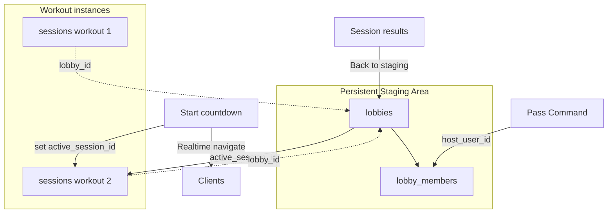

# Daisy-Chaining Missions — Phased Implementation Plan

## Current state (what we must build on)

There is **no persistent lobby**. Staging is a `sessions` row in `waiting`/`setup`. Identity, invite links, and realtime are all keyed by `session_id`.

| Concern        | Today                                                                                             |
| -------------- | ------------------------------------------------------------------------------------------------- |
| Room id        | `sessions.id`                                                                                     |
| Host authority | Opaque `sessions.host_token` + `participants.role = 'host'`                                       |
| Route          | Single `/session/:sessionId` for waiting → live → finished                                        |
| Post-workout   | `[SessionScorecard](src/components/SessionScorecard.tsx)` in place; primary exit is **Back home** |
| Presence       | Session channel presence (online dots only); no host failover                                     |
| Force nav      | None — phase changes are in-page                                                                  |

Key files: `[20260822100000_initial_lobby_schema.sql](supabase/migrations/20260822100000_initial_lobby_schema.sql)`, `[useSessionChannel.ts](src/lib/realtime/useSessionChannel.ts)`, `[SessionWaitingRoomPage.tsx](src/pages/SessionWaitingRoomPage.tsx)`, `[useLiveAmrapSession.ts](src/hooks/useLiveAmrapSession.ts)`.

**Vocabulary (locked):** UI says **Staging area**, **Pass Command**, **session** / **mission**. Do **not** call the room a Squad — Squad is the friends list (`[CLAUDE.md](CLAUDE.md)`). Prefer **crew** for people in the room.

## Locked product defaults

- **Ad-hoc Create/Join only** in this epic. Campaign live sessions, featured WODs, and makeups stay one-shot until a later epic.
- **Host must be authenticated** (`create_session` already requires auth). Pass Command / auto-reassign only to **claimed** members with `user_id`. Guests may train in each session but cannot hold command.
- **New parent entity** `lobbies` + `lobby_members`; each workout remains a normal `sessions` row linked by `lobby_id`.

---

## Phase 1 — Database & RPCs (lobby container + host transfer)

**Goal:** Schema and SECURITY DEFINER RPCs only. No UI yet. Ship behind feature flag or unused by clients until Phase 2+.

### Schema

New migration (timestamp after `20260901200000`):

`**lobbies**`

- `id uuid PK`
- `host_user_id uuid NOT NULL` → auth user currently holding command
- `active_session_id uuid NULL` → FK `sessions(id)` ON DELETE SET NULL
- `status text` check (`open` | `closed`)
- `created_at`, `updated_at`
- RLS: enabled; revoke direct writes; column SELECT for Realtime (never expose secrets)

`**lobby_members**`

- `id uuid PK`
- `lobby_id` FK cascade
- `user_id uuid NULL` (null = guest seat for a single workout join path; host candidates require non-null)
- `nickname text NOT NULL`
- `status text` check (`active` | `left`)
- `last_seen_at timestamptz` (heartbeat for AFK — written Phase 5, column now)
- `joined_at`
- Unique partial index on `(lobby_id, user_id) WHERE user_id IS NOT NULL AND status = 'active'`

`**sessions**`

- Add nullable `lobby_id uuid` FK → `lobbies(id)`
- Grant SELECT on `lobby_id` to anon/authenticated for Realtime

### RPCs (all `SECURITY DEFINER`, RPC-only mutations)

| RPC                                                                     | Behavior                                                                                                                                                                                                                                                                                                                        |
| ----------------------------------------------------------------------- | ------------------------------------------------------------------------------------------------------------------------------------------------------------------------------------------------------------------------------------------------------------------------------------------------------------------------------- |
| `create_lobby_session(...)`                                             | Replaces/wraps ad-hoc `create_session` path: create lobby + first session + host member + host participant; return `{ lobby_id, session_id, host_token, participant_id, claim_token }`                                                                                                                                          |
| `join_lobby(lobby_id, nickname)`                                        | Add/reclaim lobby member; if `active_session_id` is `waiting`, also join that session (reuse waiting-gate rules); return lobby + session identity                                                                                                                                                                               |
| `pass_lobby_command(lobby_id, to_user_id)`                              | Caller must be current `host_user_id`; target must be active member with `user_id`; flip `lobbies.host_user_id`; if active session is `waiting`/`setup`, rotate `host_token`, demote old host participant to `joiner`, promote target’s participant to `host`; return new `host_token` to the new host only                     |
| `start_next_lobby_session(lobby_id, duration, workout, template_id, …)` | Caller must be host; prior `active_session_id` must be null or `finished`; create new session with `lobby_id`; insert participants for all active lobby members (host role for `host_user_id`); set `active_session_id`; return `{ session_id, host_token, participant_id }` to host; joiners reclaim via `join_lobby` / resume |
| `leave_lobby(lobby_id)`                                                 | Mark member left; if leaver was host, run same successor rules as AFK (Phase 5) or require Pass Command first in Phase 1                                                                                                                                                                                                        |
| `close_lobby(lobby_id)`                                                 | Host only; status `closed`; clear `active_session_id`                                                                                                                                                                                                                                                                           |

Keep existing `update_session_state` / countdown RPCs — they stay session-scoped and host_token-gated. Daisy-chain does **not** reuse a finished session row.

### Host token rule (critical)

Do **not** share one forever-token across workouts. Each new session mints a fresh `host_token`. Pass Command mid-staging rotates the token for the **current** waiting session and returns it only to the new host’s client (same pattern as reclaim today in `[join_session` reclaim](supabase/migrations/20260831170000_join_session_reclaim_by_user.sql)).

### Tests

SQL fixture smoke + TypeScript API wrappers in `src/lib/api/` (new `lobby.ts`) with vitest mocks mirroring `[sessions.test.ts](src/lib/api/sessions.test.ts)`.

**Exit criteria:** Migrations apply; RPCs enforce ACL; no UI changes required yet.

---

## Phase 2 — Realtime lobby channel + routing shell

**Goal:** Clients can subscribe to a lobby and navigate between staging and session without losing the room.

### Realtime

New channel `lobby:{lobbyId}` in e.g. `[src/lib/realtime/useLobbyChannel.ts](src/lib/realtime/useLobbyChannel.ts)`:

- `postgres_changes` on `lobbies` (filter `id=eq…`) — especially `host_user_id`, `active_session_id`, `status`
- `postgres_changes` on `lobby_members` (filter `lobby_id=eq…`)
- Presence keyed by `lobby_member_id` (or `user_id`) for “who’s in staging”

Keep existing `session:{sessionId}` channel for workout sync unchanged.

### Routing

| Route                 | Purpose                                               |
| --------------------- | ----------------------------------------------------- |
| `/lobby/:lobbyId`     | Persistent Staging area (new page)                    |
| `/session/:sessionId` | Unchanged live workout + results                      |
| `/join?l={lobbyId}`   | Join lobby (new); keep `/join?s=` for legacy/featured |

`[App.tsx](src/App.tsx)`: add lobby route. Create flow navigates to `/lobby/:id` when waiting, or `/session/:id` if you prefer deep-link straight into first session **while also** storing `lobbyId` in client state / sessionStorage (`amrap_lobby_id_{sessionId}`).

**Forced launch listener (shared hook):** whenever `lobbies.active_session_id` changes to a new id, any client on `/lobby/:id` **or** still on a finished `/session/:oldId` for that lobby navigates to `/session/:newId` (replace). Persist lobby id on the client when entering a room so AAR viewers still know which lobby to watch.

### Identity storage

Extend `[sessionIdentity.ts](src/lib/sessionIdentity.ts)` (or sibling `lobbyIdentity.ts`) for `lobby_id`, lobby member id, and per-session host tokens (already per-session keys — good).

**Exit criteria:** Manual two-browser test: host starts next session → joiner on lobby route auto-navigates.

---

## Phase 3 — Staging UI + Pass Command

**Goal:** Host can pick the next workout and pass command in the Staging area.

### New / adapted UI

- `**LobbyStagingPage**` (or rename carefully): roster from `lobby_members` + presence; host sees workout picker (reuse create-session template picker pieces from `[CreateSessionPage](src/pages/CreateSessionPage.tsx)` / summary panel — surgical extract, don’t redesign).
- **Pass Command:** next to each eligible crewmate (active, has `user_id`, not self) — muted control matching existing patterns; calls `pass_lobby_command`; on success new host stores `host_token` and gains Start / countdown / picker.
- Non-hosts see read-only “Waiting for host to pick the next session.”
- Invite copy: rally link becomes lobby URL via `buildLobbyInviteUrl` (parallel to `[buildRallyInviteUrl.ts](src/lib/session/buildRallyInviteUrl.ts)`).

### Wire create/join

- `[CreateSessionPage](src/pages/CreateSessionPage.tsx)` → `create_lobby_session`
- `[JoinSessionPage](src/pages/JoinSessionPage.tsx)` → support `?l=`; session `?s=` remains for non-lobby sessions

**Exit criteria:** Host A passes to Host B; B can arm countdown; A loses host controls in realtime.

---

## Phase 4 — AAR → Staging + straggler pull

**Goal:** Post-workout primary CTA returns to the room; late viewers still get pulled into the next launch.

### Session results (AAR)

In `[SessionWaitingRoomPage.tsx](src/pages/SessionWaitingRoomPage.tsx)` / scorecard chrome when `session.lobby_id` is set:

- Primary CTA: **Back to staging** → `/lobby/{lobbyId}` (not Back home)
- Keep Back home as secondary
- Practice mode unchanged (`endPractice`)

### Stragglers

While `phase === 'finished'` and `lobby_id` present, mount the lobby channel (or a lightweight `active_session_id` subscription). On `active_session_id` change ≠ current session → `navigate(/session/newId, { replace: true })` and bootstrap identity via `join_lobby` / resume so they land in countdown/`setup`/`work` with the crew.

**Exit criteria:** Two clients finish → both return to staging → host launches → both (including one still on scorecard) enter the new session.

---

## Phase 5 — Host AFK / disconnect reassignment

**Goal:** Staging does not soft-lock when the host disappears.

### Mechanism

1. Lobby presence + periodic `touch_lobby_presence(lobby_id)` updating `lobby_members.last_seen_at` (every ~15s while on `/lobby/:id`).
2. RPC `claim_lobby_command_if_stale(lobby_id)` (any active authenticated member): succeeds only if current host’s `last_seen_at` older than grace (e.g. 45s) **or** host has `status = left`; assigns to caller or to earliest `joined_at` active claimed member (deterministic); rotates waiting-session host_token like Pass Command.
3. Client: if presence shows host offline beyond grace, eligible members call the RPC (debounce; server is source of truth to avoid races).

**Do not** auto-reassign during `work` in this epic — mid-workout host loss stays “Waiting on host for session control” (existing copy). Only Staging (`waiting` / no active session / finished between missions).

**Exit criteria:** Host closes tab in staging; within grace, another member becomes host and can launch.

---

## Phase 6 — Hardening, analytics, deferrals

- Analytics events: `lobby_created`, `lobby_joined`, `command_passed`, `lobby_next_session`, `lobby_host_reassigned`, `lobby_closed`
- Cap: lobby member count aligned with session max (6)
- Close empty lobbies / TTL optional
- Docs: short epic note under `docs/` describing lobby vs session
- **Explicitly deferred:** campaign occurrence sessions, featured WOD, makeup pacers, guest-as-host, mid-workout host failover

---

## Risk & edge-case mitigation

| Risk                                                  | Mitigation                                                                                                                                                                                                        |
| ----------------------------------------------------- | ----------------------------------------------------------------------------------------------------------------------------------------------------------------------------------------------------------------- |
| Dual authority (`host_token` vs `host_user_id`) drift | Single write path: Pass Command / reassign / start_next always update both in one transaction                                                                                                                     |
| Stale host_token after Pass Command                   | Old host’s next `update_session_state` fails; UI clears controls on `host_user_id` mismatch                                                                                                                       |
| Guest cannot reclaim across sessions                  | Each `start_next` creates new participant rows; guests re-enter via join with nickname or must claim/sign-in to stay in `lobby_members` across workouts — Phase 3 copy: “Save to keep your spot between sessions” |
| Force-nav while typing partials                       | Prefer navigate after partials saved **or** soft banner “Next session starting — Join now” with auto-nav after 5s; default to auto-nav once partials modal closed, interrupt only if still open                   |
| Realtime miss                                         | On lobby page focus/visibility, refetch lobby row; on session bootstrap, if `lobby.active_session_id` differs, redirect                                                                                           |
| Host cap (3 active)                                   | `start_next` counts against host cap using lobby host; closed lobbies / finished-only rooms don’t count                                                                                                           |
| RLS / Realtime leak                                   | Same pattern as sessions: permissive SELECT for channel filter, mutations only via RPCs; no `host_token` in SELECT grants                                                                                         |
| Squad vocabulary bleed                                | Review copy against `[CLAUDE.md](CLAUDE.md)` before merge                                                                                                                                                         |

---

## Suggested execution order (review gates)

1. **Approve Phase 1 schema/RPC shapes** → implement + `supabase db push` + API tests
2. **Approve Phase 2 routing/channel** → lobby page shell + force-nav hook
3. **Approve Phase 3 staging UX** → Pass Command + next-workout picker
4. **Approve Phase 4 AAR CTAs** → straggler pull
5. **Approve Phase 5 AFK rules** (grace seconds, successor order) → implement
6. Phase 6 polish / analytics

No code in this planning step. First implementation PR should be Phase 1 only unless you explicitly expand the gate.