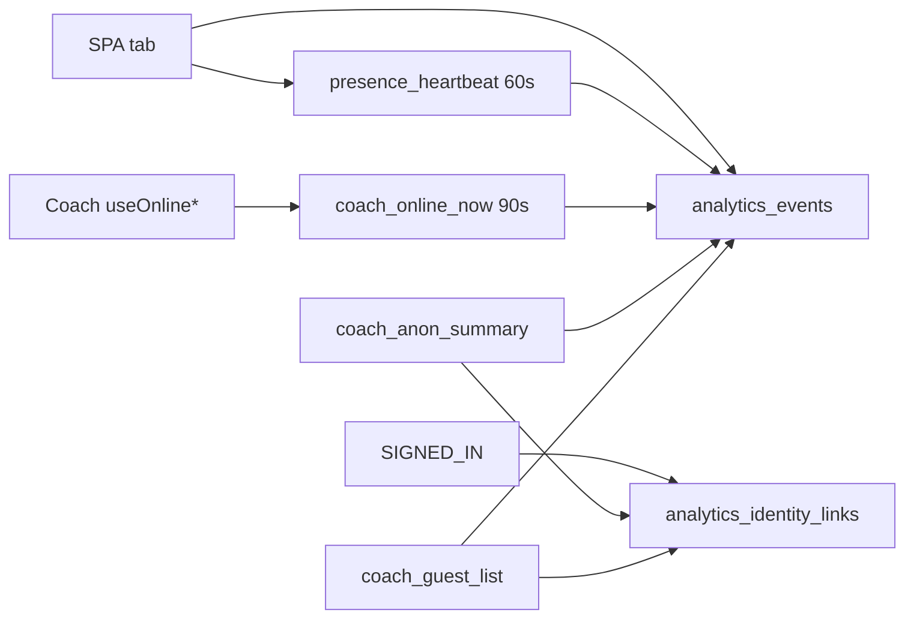

# Anonymous guest tracking (Coach analytics)

**Shipped:** 2026-09  
**Audience:** coaches using `/coach`, and engineers deploying the migrations  
**Epic:** [anonymous-guest-tracking.md](../../epics/anonymous-guest-tracking.md)  
**Audit:** [anonymous-guest-tracking-2026-09.md](../../audits/anonymous-guest-tracking-2026-09.md)

## What this is

The product is guest-first. This update makes Coach’s guest numbers honest and turns a live Guest row into something you can inspect — without forcing visitors to create an account.

**Guest** = no signed-in account.  
**Browser id** = long-lived `amrap_anon_id` in the browser (`localStorage`).  
**Mission seat** = claim token for one workout (not this identity).  
**Session** = auth session only.

## What coaches get

| Surface                       | Before                                                                         | After                                                                                           |
| ----------------------------- | ------------------------------------------------------------------------------ | ----------------------------------------------------------------------------------------------- |
| Top strip                     | “Unique visitors (anon)” — all-time every browser id, including signed-in ones | **Guest browsers (7d)** — distinct unlinked guests in the last seven days                       |
| Anonymous Now                 | Live green-dot ids only; no history                                            | Same live list, clickable → compact **Guest browser** dossier                                   |
| Past 24h / 3d / Week / Lapsed | Accounts only                                                                  | Same tabs: **Accounts** table + **Guests** table (unlinked browsers from events)                |
| Active Now / Anonymous Now    | Fed by public `presence:global` (every SPA tab joined the roster)              | Fed by `presence_heartbeat` events + coach-only `coach_online_now` (90s window)                 |
| Privacy                       | No athlete-facing copy for the device id                                       | `/privacy` section **Your browser id**                                                          |
| Guest browsers detail         | Single 7d strip number only                                                    | Click **Guest browsers (7d)** → panel with 24h / 3d / 7d / 30d / 90d / 365d + time-series chart |

### Guest browsers chart panel

Click the Overview **Guest browsers (7d)** card to open a panel under the strip:

- Range tabs: Past 24 Hours, Past 3 Days, Past Week, Past Month, Past 3 Months, Past 12 Months
- Big total = distinct guest browsers in that window (same definition as the strip: unsigned-in events)
- Chart = hourly buckets for 24h, daily buckets for longer windows (`coach_guest_browsers_series`)
- Hover a bar for that bucket’s guest count; if a shared note exists, it shows under the count
- Click a bar (24h–90d) to edit one shared team note per bucket (`coach_chart_notes`); Clear deletes it
- Past 12 Months stays a read-only line chart (no bar notes)
- Dismiss or click the card again to close

The strip card itself always shows the 7d total from `coach_dashboard`.

### Dossier (Anonymous Now or Guests table)

Click a truncated anon id to open a card under the table:

- Last seen, last route, event counts (90 days)
- Recent events for that browser
- Linked account nickname if they signed in on that browser (Phase 2 stitch)
- Honest empty state when the browser is online but has no events yet

Dismiss closes the card. Selecting another id remounts it.

### What this does _not_ do

- It does not map roster nicknames to browser ids (mission seat ≠ anon id).
- It does not track people who only read Astro marketing pages and never open the SPA.
- It does not add a consent banner or guest opt-out RPC.
- Historical Guests hide browsers once they are linked to an account.

## How it works (engineer view)

| Phase       | Behaviour                 | Key pieces                                                                                  |
| ----------- | ------------------------- | ------------------------------------------------------------------------------------------- |
| 1           | Honest 7d guest count     | `guestBrowsers7d` on `coach_dashboard`; Coach top strip label                               |
| 2           | Stitch on sign-in         | `analytics_identity_links` + `link_anon_identity`; called from auth, never blocks UX        |
| 3           | No `'unknown'` bucket     | `getOrCreateAnonId()` → `string \| null`; `track` omits `anon_id` when null                 |
| 4           | Anon dossier              | `coach_anon_summary`, optional `p_anon_id` on recent events; compact card under the table   |
| 5           | Historical Guests         | `coach_guest_list` for the four activity buckets; Accounts table unchanged                  |
| 6           | Coach-only “now”          | SPA stops joining `presence:global`; 60s heartbeat; Coach polls `coach_online_now` ~15s     |
| 7           | Privacy disclosure        | Astro `/privacy` — browser id, write-only events, optional link on sign-in, clear site data |
| Chart panel | Multi-window guest series | Selectable Overview card → `coach_guest_browsers_series` + SVG chart                        |
| Bar notes   | Shared coach annotations  | `coach_chart_notes` + hover count / click-to-edit on bars                                   |

Migrations (apply in order via `npx supabase db push`):

- `20260903170000_coach_guest_browsers_7d.sql`
- `20260903180000_analytics_identity_links.sql`
- `20260903190000_coach_anon_summary.sql`
- `20260903200000_coach_guest_list.sql`
- `20260903210000_coach_online_now.sql`
- `20260905120000_coach_guest_browsers_series.sql`
- `20260905130000_coach_chart_notes.sql`

## Deploy notes

1. Push migrations before production Coach “now” / guest cohorts / dossier RPCs are relied on.
2. Frontend can ship heartbeats before `coach_online_now` exists — until the RPC is live, online sets stay empty (honest), not a leaked roster.
3. Verify after deploy:
   - Guest opens SPA → heartbeat rows appear; Coach Anonymous Now updates within ~90s.
   - Guest signs in → `analytics_identity_links` row; dossier shows linked account; Guests table no longer lists that id.
   - `/privacy` shows **Your browser id** on the Astro site (not the SPA shell).

## Related code

- Client identity / track: `src/lib/analytics/identity.ts`, `src/lib/analytics/track.ts`
- Heartbeat: `src/hooks/useGlobalPresenceBroadcast.ts`
- Coach online poll: `src/hooks/useOnlineUserIds.ts`, `fetchCoachOnlineNow` in `src/lib/api/coach.ts`
- UI: `src/pages/CoachPage.tsx`, `src/components/coach/CoachActivityCohorts.tsx`, `src/components/coach/CoachAnonDossierCard.tsx`, `src/components/coach/CoachGuestBrowsersPanel.tsx`
- Privacy copy: `site/pages/privacy.astro`
