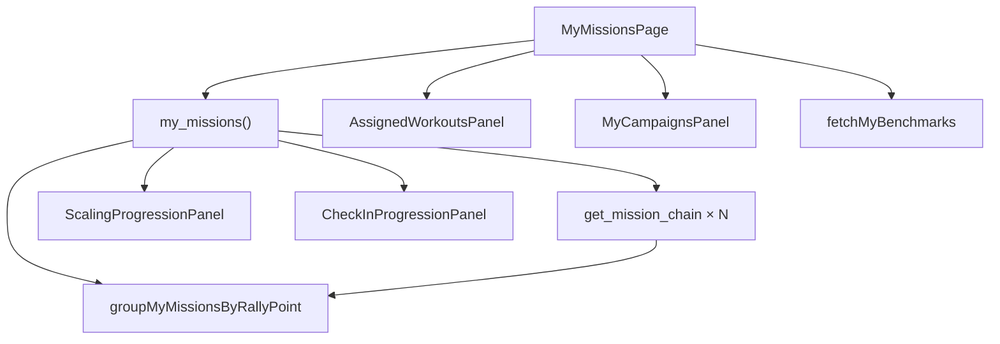

# My missions — architectural assessment and gap analysis

**Date:** 2026-09-10  
**Surface:** `/my-missions` (`MyMissionsPage`)  
**Trigger:** Architectural assessment of the account history hub — composition,
data contracts, auth, performance, vocabulary, and test coverage.  
**Related:** [personal-benchmarks](../../plans/personal-benchmarks.md) (why HUD
got a narrow RPC), [modified-movements](../../plans/modified-movements.md)
(progression + check-ins on this read path),
[smart-recovery](../../epics/smart-recovery.md) (do not extend `my_missions` for
recovery), [coach-analytics README](../coach-analytics/README.md) (sibling
readme folder convention).

**Vocabulary:** A **mission** is one workout. A **campaign** is a multi-week
programme. **Rally point** is the waiting room for a mission; **Next Mission**
is the durable hub title on `/rally-point/:id`. A **session** is an auth
session only. `missions.state = 'work'` must read as **Live** in athlete UI.

---

## Verdict

`/my-missions` is a soft-gated, lazy, `noindex` SPA hub that loads an
**unbounded, workout-heavy** `my_missions()` payload once, groups hub/chain
siblings client-side, and nests campaigns, assigned workouts, and two
progression panels on the same page. There is no Realtime and no refetch on
focus.

The architecture fits a “saved history + related account lists” product job,
but the page has grown into a composite home for several account concerns while
still paying the full-history payload cost that benchmarks and Smart Recovery
already escaped. Highest-priority remaining gaps: soft auth / no in-page
sign-in CTA, stale list after mutations elsewhere, and page composition.
P0 vocabulary (V1–V3) and P1 payload/chains (D1–D2) are addressed.

---

## 1. What the page is for

| Athlete question                             | Answered by                                          |
| -------------------------------------------- | ---------------------------------------------------- |
| What have I trained / saved?                 | Mission list from `my_missions()`                    |
| What did a squad friend put on my list?      | `AssignedWorkoutsPanel`                              |
| Which campaigns am I running?                | `MyCampaignsPanel`                                   |
| How has my scaling / check-in pattern moved? | `ScalingProgressionPanel`, `CheckInProgressionPanel` |
| Is this workout a personal benchmark?        | Pill + Retire via `fetchMyBenchmarks`                |

Outbound: **View mission** → `/mission/:id`, **Plan mission** → `/create`,
**New campaign** → `/campaign/new`, campaign rows → `/campaign/:id`.

Inbound: header **My missions**, Join page **All my missions**, waiting-room
recovery link when identity is missing. Claiming “Save this mission to my
account” on a finished guest mission is how rows appear here.

---

## 2. Current architecture

### 2.1 Entry and chrome

| Concern        | Detail                                                                                                                 |
| -------------- | ---------------------------------------------------------------------------------------------------------------------- |
| Route          | [`App.tsx`](../../../src/App.tsx) — `lazy(() => import('./pages/MyMissionsPage'))`, bare `<Route path="/my-missions">` |
| Auth at router | **None.** Peers like `/squad`, `/campaign/*`, `/hud` use `RequireIntake`                                               |
| Page gate      | [`useAmrapAuth`](../../../src/hooks/useAmrapAuth.ts) — guests see copy, no RPC                                         |
| SEO            | [`routes.ts`](../../../src/lib/seo/routes.ts) — title “My missions”, `index: false`                                    |
| Deploy         | `vercel.json` rewrites `/my-missions` → app shell                                                                      |
| Post-auth      | Sign-**up** from this path resolves to `/create`; sign-**in** stays                                                    |

### 2.2 Page composition

[`MyMissionsPage.tsx`](../../../src/pages/MyMissionsPage.tsx) (~500 lines):

```
NarrowPageLayout ("My missions" / "Saved to your account")
├── Plan mission | New campaign
├── AssignedWorkoutsPanel          → own RPC
├── MyCampaignsPanel               → my_campaigns
├── ScalingProgressionPanel(entries)
├── CheckInProgressionPanel(entries)
├── loading / guest / empty / error
├── groupMyMissionsByRallyPoint(entries, chains)
│   ├── single → MyMissionCard
│   └── group  → parent MyMissionCard + expand
│                 └── started MyMissionCard | QueuedMissionCard
├── MyMissionScoreBreakdownModal
└── Back home
```

Each `MyMissionCard` can show: movements disclosure, when/duration/score/state,
Modified badge, Benchmark pill + Retire, View mission, View breakdown, Share,
Add squad member, chain expand, Delete (host incomplete), check-in summary.

### 2.3 Data layer

**Canonical RPC** (latest body):
[`20260909190000_check_in_on_read_paths.sql`](../../../supabase/migrations/20260909190000_check_in_on_read_paths.sql)
— `my_missions() RETURNS jsonb`, `SECURITY DEFINER`, requires `auth.uid()`,
granted to `authenticated` only.

**Response:** `{ ok: true, missions: [...] }`

**Per row (current):** participant identity + role; mission id, times, featured
flag, duration, full `workout` jsonb, template id, rally point id, state,
segment; correlated `chain_item_count` / `chain_unstarted_count`; round count;
partial reps, final score, score breakdown, modified movements, movement
variants, RPE, session notes, check-ins; coach workout name via
`template_id = 'coach:' || id`.

**Filter:** `participants.user_id = auth.uid()`, excluding featured finished
rows with no score breakdown (cancelled featured slots).  
**Order:** `coalesce(scheduled_at, created_at) DESC`.  
**Limit:** none — full history.

**Client:** [`myMissions.ts`](../../../src/lib/api/myMissions.ts) —
`fetchMyMissions`, `deleteIncompleteMission`, score/share/delete helpers.

**RPC evolution (additive):**

| Migration                                           | Added                                       |
| --------------------------------------------------- | ------------------------------------------- |
| `20260901400000_mission_rename.sql`                 | Rename-era function + grants                |
| `20260908120000_my_missions_rally_point_id.sql`     | `rally_point_id`                            |
| `20260908130000_my_missions_chain_counts.sql`       | chain counts (avoids N empty chain fetches) |
| `20260909120000_modified_movements_comparisons.sql` | `modified_movements`                        |
| `20260909160000_variants_on_read_paths.sql`         | `movement_variants`                         |
| `20260909190000_check_in_on_read_paths.sql`         | `rpe`, `session_notes`, `check_ins`         |

### 2.4 Client grouping and chains

[`groupMyMissionsByRallyPoint`](../../../src/lib/mission/groupMyMissionsByRallyPoint.ts):

1. Bucket by `rallyPointId`; null hub → singles.
2. Planned chain (`get_mission_chain` length ≥ 2): parent = position 0 started
   mission (with guest-join fallback that avoids parent/child duplicate);
   children started or queued.
3. Else ≥2 siblings on a hub: newest parent, older children ascending.
4. Sort list newest-first.

After `my_missions` resolves, the page fetches `getMissionChain` only for hubs
with `chainItemCount >= 2` (parallel `Promise.all`).

Campaigns are **not** mission rows; they are a sibling panel.

### 2.5 Fan-out on load

For a signed-in athlete the page (and nested panels) typically issue:

1. `my_missions`
2. `N × get_mission_chain` (only hubs with a real chain)
3. `my_campaigns` (panel)
4. assigned-workouts list (panel)
5. `fetchMyBenchmarks` (benchmark pills)

No Realtime channel. No visibility/focus refetch. Delete patches local state
only.



---

## 3. Gap analysis

Severity: **P0** ship-breaking or brand/click-rule violation athletes hit now;
**P1** correctness, scale, or product clarity debt; **P2** polish / test /
docs.

### 3.1 Data and performance

| ID  | Sev | Gap                                                     | Notes                                                                                                                     |
| --- | --- | ------------------------------------------------------- | ------------------------------------------------------------------------------------------------------------------------- |
| D1  | P1  | ~~Unbounded heavy `my_missions` payload~~ **Addressed** | Slim list rows + `my_mission_detail` for workout/breakdown; HUD repair uses `list_unlocked_amqap`.                        |
| D2  | P1  | ~~N chain RPCs after list load~~ **Addressed**          | `my_missions` embeds `chains` (queued workouts only); page no longer fans out `get_mission_chain`.                        |
| D3  | P1  | Stale after external mutation                           | Claiming a mission, finishing elsewhere, or campaign changes do not refresh until remount. No Realtime, no focus refetch. |
| D4  | P2  | No pagination / filters                                 | Fine for early users; will hurt once history is long even if payload were slimmed.                                        |

### 3.2 Auth and navigation

| ID  | Sev | Gap                                | Notes                                                                                                                  |
| --- | --- | ---------------------------------- | ---------------------------------------------------------------------------------------------------------------------- |
| A1  | P1  | Soft auth vs `RequireIntake` peers | Incomplete profiles can open the page; squad/plan/campaign cannot. May be intentional for history, but inconsistent.   |
| A2  | P1  | Guest UX is quiet                  | Signed-out copy with **no** AuthModal / sign-in CTA on the page. Top CTAs still link to `/create` and `/campaign/new`. |
| A3  | P2  | Sign-up leaves the page            | Post-auth destination from `/my-missions` goes to `/create`, not back here after claim-oriented journeys.              |

### 3.3 Product / vocabulary (click-rule)

| ID  | Sev | Gap                                                           | Notes                                                                                                                                                   |
| --- | --- | ------------------------------------------------------------- | ------------------------------------------------------------------------------------------------------------------------------------------------------- |
| V1  | P0  | ~~Raw `entry.state` on the card~~ **Addressed**               | Card meta / share / host scheduled / waiting room use [`formatMissionStateLabel`](../../../src/lib/mission/formatMissionStateLabel.ts) (`work` → Live). |
| V2  | P0  | ~~Featured delete confirm says “Featured WOD”~~ **Addressed** | Confirm: “Cancel today's mission for this date and time only? …”                                                                                        |
| V3  | P2  | ~~Share text includes raw `state`~~ **Addressed**             | Same helper via `formatMyMissionShareText`.                                                                                                             |
| V4  | P2  | Migration comment “multi-mission session”                     | Historical SQL comments only; not user-visible.                                                                                                         |

Host scheduled list delegates to the same helper (`work` → Live).

### 3.4 Composition / single job

| ID  | Sev | Gap                    | Notes                                                                                                                                                                                                                    |
| --- | --- | ---------------------- | ------------------------------------------------------------------------------------------------------------------------------------------------------------------------------------------------------------------------ |
| C1  | P1  | Composite hub          | History + assigned + campaigns + two progression panels + benchmarks. Assigned and campaigns are justified (“what’s waiting” / “what programme”), but the first viewport is a stack of jobs rather than one composition. |
| C2  | P2  | Duplicate title chrome | Mobile subtitle via `NarrowPageLayout` and a desktop-only h1 block both say “My missions”.                                                                                                                               |

### 3.5 Correctness / edge cases

| ID  | Sev | Gap                              | Notes                                                                                                                           |
| --- | --- | -------------------------------- | ------------------------------------------------------------------------------------------------------------------------------- |
| E1  | P2  | Delete does not refresh chains   | Removing a hub mission from local `entries` may leave expand state / chain map until remount.                                   |
| E2  | P2  | Benchmark load errors are silent | Failed `fetchMyBenchmarks` leaves pills empty with no message.                                                                  |
| E3  | P1  | Score display vs finalScore      | Card correctly shows performed reps/rounds, not PVI-adjusted `finalScore` — keep this; breakdown modal owns the adjusted story. |

### 3.6 Tests

| Area                                  | Covered                                                              | Gaps                                                                                                                                        |
| ------------------------------------- | -------------------------------------------------------------------- | ------------------------------------------------------------------------------------------------------------------------------------------- |
| `MyMissionsPage.test.tsx`             | Titles, delete, featured confirm, chain expand, CTAs, campaigns link | Guest copy, loading, fetch error, empty state, Share, breakdown modal, Modified, benchmarks/Retire, progression panels, chain fetch failure |
| `myMissions.test.ts`                  | Score display, share, delete mapping, rally/chain parse              | Check-ins / variants / modified parse, `ok !== true`, malformed row drop                                                                    |
| `groupMyMissionsByRallyPoint.test.ts` | Singles, daisy, planned chain, guest fallback, queued mix            | scheduledAt vs createdAt sort; leftover singles after partial consume                                                                       |

### 3.7 Plans that already constrain this surface

| Doc                       | Implication                                                                            |
| ------------------------- | -------------------------------------------------------------------------------------- |
| personal-benchmarks       | Do not pull HUD scores from `my_missions`; keep pills here lightweight                 |
| smart-recovery            | Do **not** extend this RPC for recovery history                                        |
| modified-movements        | Progression + Modified badge belong here; check-ins stay on this read path for privacy |
| seo-roadmap               | Keep `noindex`                                                                         |
| share-card / replay plans | Richer Share from history rows is future work; Share already exists                    |

---

## 4. Recommended directions (not a commitment)

Ordered for impact vs risk. Implementation is out of scope for this note.

1. ~~**Map mission state for display and share**~~ **Done** —
   `formatMissionStateLabel` on card meta, share text, host scheduled list, and
   waiting room; Featured delete confirm uses “today's mission”.
2. ~~**Slim or paginate `my_missions`**~~ **Done (slim, not paginate)** —
   list projection drops workout/breakdown; `my_mission_detail` hydrates on
   demand; chains embedded; `list_unlocked_amqap` for HUD repair. Pagination
   (D4) still open.
3. **Guest + incomplete-profile decision** — either `RequireIntake` with guest
   passthrough + in-page sign-in, or keep soft gate but add an explicit Auth
   CTA (A1, A2).
4. **Refetch policy** — at least refetch on window focus after delete/claim;
   Realtime is optional and probably overkill for a history list (D3).
5. **Close test gaps** on guest, empty, error, parse of check-in fields, and
   state-label formatting once (1) lands.

---

## 5. What is already solid

- RPC-only access; tables stay RLS-locked from the client.
- Chain counts on the list RPC avoid empty N+1 for most hubs.
- Grouping pure function with good chain/guest tests.
- Score card shows performed work, not adjusted final score.
- Campaigns and assigned workouts are separate RPCs with clear jobs.
- SEO `noindex` for a signed-in surface.
- Lazy route keeps the shell light until the athlete opens history.
- Vocabulary on primary CTAs (Plan mission, View mission, New campaign) is
  mostly clean.

---

## 6. Key paths

| Role       | Path                                                           |
| ---------- | -------------------------------------------------------------- |
| Page       | `src/pages/MyMissionsPage.tsx`                                 |
| API        | `src/lib/api/myMissions.ts`                                    |
| Grouping   | `src/lib/mission/groupMyMissionsByRallyPoint.ts`               |
| Latest SQL | `supabase/migrations/20260910620000_my_missions_slim_list.sql` |
| Route      | `src/App.tsx`                                                  |
| SEO        | `src/lib/seo/routes.ts`                                        |
| Page tests | `src/pages/MyMissionsPage.test.tsx`                            |
