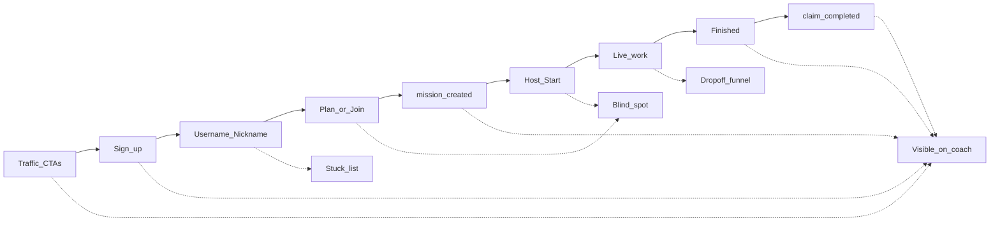

# Epic: Onboarding Activation — See Why New Users Don’t Train

**Branch:** TBD — suggest `feature/onboarding-activation`  
**Status:** Draft — Phase 0 complete; Phase 1 next  
**Last updated:** 2026-09-10

**Related:** [Phase 0 findings](./phase0-findings.md), [JIT onboarding](../../docs/epics/jit-onboarding.md) (Launch → auth → identity → rally point), [anonymous guest tracking](../../docs/epics/anonymous-guest-tracking.md), [analytics back-end roadmap](../../docs/epics/analytics-back-end-roadmap), `/coach` (Content & acquisition, Funnels, Incomplete sign-ups, Explore).

---

## Vision

New users sign up and still do not do workouts. Today `/coach` can show acquisition → signup → finished and mid-work abandon, but it cannot answer the activation middle: **profile done → opened Plan → created → waiting room → Start → live**. Until that funnel is visible, product changes are guesses.

This epic closes the measurement gap first, then uses the data to justify (or kill) product fixes. It does **not** replace JIT onboarding; it tells us whether JIT shipped and still fails after identity, or fails before Start.

> If a word sits on something you click, write it in plain English. Activation metrics on `/coach` must use Mission / Start / Finished — not lobby/session/WOD in athlete-facing copy.

---

## Problem statement

Onboarding is optimized for **guest → train now**, then claim later. That is intentional. The failure mode we cannot see clearly is signed-in (or guest-finished) athletes who never reach a live clock.



---

## Current architecture (baseline)

### Athlete funnel (product)

| Path | Auth to train? | Identity | Intended success |
| ---- | -------------- | -------- | ---------------- |
| Guest host `/create` (now) | No | Nickname only | Finish → later claim |
| Guest join `?m=` / Featured | No | Nickname | Finish → claim |
| Signed-in host | Yes | Username + nickname | Create → Start → finish → My missions |
| Plan / campaign / squad / HUD | Hard gates | `RequireIntake` | Account hubs |

Design choices that matter for diagnosis:

1. **Signup defaults to `/create`, never `/intake`** ([`postAuthDestination.ts`](../../src/lib/auth/postAuthDestination.ts)) — identity deferred to Launch overlay or a later hard gate.
2. **SQL “intake required” ≠ client complete profile** — create RPCs often need a profile *row*; client gates need username + nickname (`profileNeedsIntake`); body metrics optional.
3. **Claim after fatigue** — guests can finish without an account; save is a second decision (`claim_*` events).
4. **No `mission_started` event** — Start is only visible as DB state (`waiting` → `work`) or countdown events.

### What `/coach` can already tell you

| Hypothesis | Where on `/coach` | What “bad” looks like |
| ---------- | ----------------- | --------------------- |
| Traffic never converts | **Content & acquisition** | High browsers, low signed up / completed |
| Auth friction | **Funnels → Sign-up** | Attempts ≫ completed; failure reasons spike |
| Stuck before identity | **Users → Incomplete sign-ups** | `needs_profile` / `intake_incomplete` via `coach_onboarding_stuck_list` |
| Creates but doesn’t finish | Overview strip + template performance | Creates ≫ finished |
| Quits mid-AMRAP | **Funnels → Mission drop-off** | Abandons clustered early/late in the clock |
| Channel quality | Acquisition “trained / completed %” | Signup without completion |
| One user story | **Users → identity journey** | Manual: anon → auth → events → missions |

Definitions that are easy to misread:

- **Trained** ≈ any `participants` row (seat), not necessarily finished.
- **Finished strip** filters finished missions by `created_at`, not finish time.
- **Abandon** fires on tab hide during `work` — noisy.

### Gap analysis (blind spots)

| Blind spot | Why it matters | `/coach` today |
| ---------- | -------------- | -------------- |
| Signed up → never opens Plan | Biggest silent cohort | No SPA pageviews |
| Opens Plan → never creates | Friction in builder | Only manual Explore (`template_selected` vs `mission_created`) |
| Creates → never Starts | Waiting-room graveyard | No Start funnel; no waiting-room enter/leave |
| Profile complete, 0 missions | “Done onboarding” but inactive | Stuck list stops at names |
| Guest finish, never claims | Workout happened, product thinks they didn’t | Claim funnel only after auth |
| Featured join window | Early visitors can’t Join | Content CTAs ≠ join availability |
| Google signup completions | Attribution hole | Attempts/failures only |

### Most likely blockers (ordered by evidence available today)

1. **Auth without identity** — verify Incomplete sign-ups + micro-dossier cancel/accept rates.
2. **Guest finish, no claim** — verify claim prompt/completed vs finished mission volume.
3. **Create without Start** — not on `/coach`; query `missions` in `waiting`/`setup` with no `work`/`finished`.
4. **Hard gates on Plan / Campaign / Squad** — only `/create` now is low-friction host path.
5. **Featured WOD timing** — Join withheld until ~15 min lead; calendar add ≠ join.
6. **Post-finish room join failure** — save succeeds, membership fails.

---

## Success metrics

| Metric | How to read it |
| ------ | -------------- |
| Signed up → identity complete (same day) | Onboarding identity conversion |
| Identity complete → first `mission_created` (7d) | Activation past Plan |
| `mission_created` → first `work` / `mission_started` (same day) | Waiting-room → Start |
| First Start → finished | Live completion |
| Guest finished → `claim_completed` (same day) | Retention of guest workouts |
| Cohort: profile complete, zero finished missions (rolling 30d) | Silent inactive — should shrink after fixes |
| Coach stuck `needs_profile` / `intake_incomplete` (new signups / week) | Should trend down for post-JIT cohorts |

Primary north star for this epic: **identity-complete users who reach Live within 7 days of signup**.

---

## Master architecture (target)

```
Acquisition / CTAs
    ↓
auth.users + athlete_profiles (identity)
    ↓
SPA surfaces: /create, /join, /mission/:id (waiting)
    ↓
analytics_events + mission state transitions
    ↓
coach_activation_funnel RPC (SECURITY DEFINER, coach-gated)
    ↓
/coach → Activation card + stuck cohorts
```

Instrument at the same boundaries the product already uses:

| Step | Signal | Source of truth |
| ---- | ------ | --------------- |
| Signed up | `auth.users.created_at` | Auth |
| Identity done | non-blank username + nickname | `athlete_profiles` + `intake_submitted` / micro-dossier events |
| Plan viewed | pageview or `create_viewed` | New event |
| Mission created | `mission_created` / `session_created` (legacy name) | Existing |
| Waiting room | `rally_point_entered` (or pageview `/mission/:id` while `waiting`) | New |
| Start | `mission_started` **or** first transition to `state = 'work'` | New event preferred; DB backfill OK |
| Finished | mission `finished` + locked score where claimed | Existing |
| Claimed | `claim_*` | Existing |

Reuse `track()` / `analytics_events`. Do not invent a second pipe. Naming: product analytics — not “telemetry” (HUD owns that word).

---

## Phase 0 — Diagnose with what exists *(ops, no ship)*

**Goal:** One pass on production-shaped data using current `/coach` + SQL so Phase 1–3 prioritize the real drop.

**Depends on:** coach access  
**Risk:** Over-interpreting “trained” as finished.  
**Status:** Complete — see [phase0-findings.md](./phase0-findings.md) (2026-09-10). SQL items 6–7 not executed (service-role blocked); partially inferred from Users + template/solo signals; queries included in findings.

### Checklist

1. [x] Acquisition: Browser → signed up → completed by channel (30d) — FB ~0% signup; Direct/Google ~5% browser→completed.
2. [x] Incomplete sign-ups **6** vs registered **7**; **3/7** profiles have 0 missions.
3. [x] Intake 8 submitted / 0 abandoned (30d); micro-dossier ~14 shown / 13 accepted / **0** cancelled.
4. [x] Missions created vs finished: 24/11 (7d), 78/32 (30d); only 26 `mission_created` events (undercount).
5. [x] Drop-off: mid-work abandon **0**; solo finish **20%** vs social **85.7%** (30d); First contact 8/0.
6. [~] Profile complete, zero finished — answered in Users UI (3 zero-mission profiles); SQL still recommended.
7. [ ] Waiting graveyard SQL — not run; inferred only.
8. [~] Explore: 26 `mission_created` vs 20 `rally_point_countdown_started` (recent) — suggestive, not definitive for Start.

### Exit criteria

- [x] Written note naming dominant drops with counts — [phase0-findings.md](./phase0-findings.md).
- [x] Decision: **instrument (Phase 1–2) + product track** — not instrument-only. Priority product: profile-complete zero-mission nudge, solo create→Start (First contact), finish JIT stuck cohort; do not chase mid-work abandon.

### Phase 0 verdict (short)

1. **Browser → signup** kills volume (esp. Facebook).  
2. **Signup → identity** blocks ~half of accounts ever created (6 stuck).  
3. **Create → finish** fails for solo (20%) with **no** mid-work abandons → waiting-room / never-Start is the likely product hole; prove with Phase 1.

---

## Phase 1 — Instrumentation

**Goal:** Close the blind spots that make “aren’t doing workouts” unmeasurable.

**Depends on:** Phase 0 direction (or ship in parallel if Phase 0 is slow)  
**Risk:** Event spam; keep payloads small and coach-aggregatable.

### Deliverables

1. **`mission_started`** — fire once when host (or system) moves the mission into Live / Start succeeds. Props: `mission_id`, `source` (`countdown` | `immediate` | `chain`), `is_host`, `participant_count` if cheap.
2. **Waiting-room presence** — `rally_point_entered` / `rally_point_left` (or single enter + duration on leave) on `/mission/:id` while state is waiting/setup. Plain English in coach UI: “Entered rally point”.
3. **Create surface view** — `create_viewed` (or SPA pageview helper scoped to `/create`) so signup → Plan is visible without Explore archaeology.
4. **Optional:** Featured join gate events (`featured_join_available` / `featured_join_blocked_window`) if Phase 0 implicates featured timing.
5. Unit tests for track call sites; no PII in props.

### Exit criteria

- [ ] Events land in `analytics_events` in staging.
- [ ] Explore can filter them by name.
- [ ] Docs in this epic list event names + props (single table).

---

## Phase 2 — `/coach` Activation funnel + cohorts

**Goal:** Make the middle of the funnel a first-class coach surface, not a SQL hobby.

**Depends on:** Phase 1 (or DB-derived Start if events lag)  
**Risk:** Coach RPC cost; keep windows and coach role gates consistent with existing coach RPCs.

### Deliverables

1. **`coach_activation_funnel`** (or extend an existing coach overview RPC) returning step counts for a window:
   - signed_up → identity_complete → create_viewed → mission_created → mission_started → finished → claimed
2. **Cohort table:** profile complete, zero finished missions (optional: zero any mission).
3. **Waiting graveyard:** missions created, never reached `work`, age buckets.
4. UI on `/coach` — Activation card under Funnels (or Overview): conversion rates between steps, not only absolute counts.
5. Clarify copy on Acquisition: **Trained** label tooltip or rename toward “Joined a mission” so it is not read as finished.

### Exit criteria

- [ ] Coach can answer “where do new users stop?” without SQL editor.
- [ ] Client parser + tests for the RPC envelope.
- [ ] Coach role / RLS pattern matches other coach RPCs.

---

## Phase 3 — Product fixes (data-gated)

**Goal:** Change the journey only where Phase 0–2 show a dominant drop. Do not ship all of these by default.

**Depends on:** Phase 0 findings; Phase 2 preferred so we can measure the fix  
**Related epic:** [JIT onboarding](../../docs/epics/jit-onboarding.md) owns Launch identity overlays (P3/P4 there).

| If dominant drop is… | Candidate fix |
| -------------------- | ------------- |
| Auth without identity | Finish JIT Phase 3/4; auto-open identity overlay once post-signup; do not dump bare `/create` forever |
| Identity → no create | Soften Plan empty state; default Featured / Today’s mission CTA; reduce hard gates on first path |
| Create → no Start | My missions / HUD CTA “Start this mission” for host `waiting` rows; waiting-room clarity |
| Guest finish → no claim | Stronger post-finish claim primary CTA; reduce second-decision friction |
| Featured window | Show join availability earlier or clearer “opens shortly” with calendar ≠ join |
| Room join after claim fails | Fix membership path; surface retry (not only “Saved. We could not add you…”) |

### Exit criteria

- [ ] Each shipped fix names the funnel step it targets and the before/after metric.
- [ ] No vocabulary regressions (Mission / Start / Rally point / Room vs Squad).

---

## Suggested ship train

| Train | Phases | Notes |
| ----- | ------ | ----- |
| **T0** | Phase 0 | Ops diagnosis this week; no migration |
| **T1** | Phase 1 | Events only; safe to land early |
| **T2** | Phase 2 | Coach Activation card |
| **T3** | Phase 3 slice | One product fix matched to measured drop |

Do **not** ship a large onboarding UX rewrite before T0/T1 unless JIT Phase 3/4 is already the known identity blocker.

---

## Out of scope

- Rewriting guest join (nickname-only play stays).
- HUD telemetry math or classification.
- Renaming data-layer `rally_points` / legacy `session_*` analytics event names wholesale (aliases / coach labels OK).
- Deleting historical stuck users (ops follow-up).
- Full SPA pageview product (only activation-critical routes unless a shared helper falls out cheaply).

---

## Open questions

1. **Start signal:** emit `mission_started` from client on successful Start RPC, derive from `missions.state` transitions in SQL, or both (event for funnel freshness, SQL for backfill)?
2. **Pageviews:** dedicated `create_viewed` / `rally_point_entered` vs a small `page_viewed { path }` helper reused later?
3. **Trained definition:** rename in coach UI now, or only after Activation funnel ships?
4. **Owner of JIT P3/P4 vs this epic:** identity overlay completion stays under `jit-onboarding.md`; this epic consumes its metrics.

---

## File touch map (expected)

| Area | Files |
| ---- | ----- |
| Events | `track` call sites: Start path, `MissionWaitingRoomPage` / live entry, `CreateMissionPage` mount |
| Coach API | `src/lib/api/coach.ts`, new/extended coach RPC migration |
| Coach UI | `src/pages/CoachPage.tsx`, `CoachFunnelCard` or new Activation card, stuck/cohort tables |
| Tests | coach API parser tests, event call-site tests, optional RPC SQL verify script |
| Docs | this epic; cross-link JIT + analytics roadmap |

---

## Phase checklist (roll-up)

- [x] **P0** Diagnose with existing `/coach` (+ SQL pending for waiting graveyard); record dominant drop — [phase0-findings.md](./phase0-findings.md)
- [ ] **P1** `mission_started` + create/waiting-room signals
- [ ] **P2** Coach Activation funnel + profile-complete-zero-missions cohort
- [ ] **P3** Data-gated product fix(es) for the measured step
